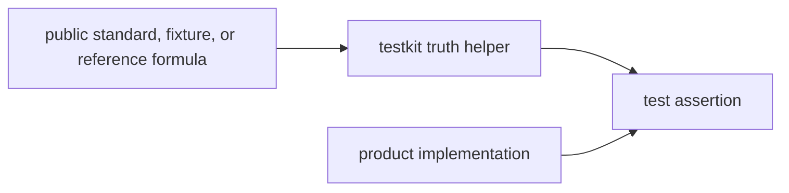

# Independence

`bijux-gnss-testkit` is useful only when its truth sources are meaningfully
independent from the production helpers they validate. Independence does not
mean every helper must be mathematically unrelated to the product code; it means
the test evidence can expose a real implementation mistake instead of replaying
the same mistake through another wrapper.

## Independence Flow

## Practical Rules

| surface | independence expectation |
| --- | --- |
| reference models | Prefer explicit formulas, checked-in reference values, or simpler alternative algorithms over calls into production solvers. |
| fixture loading | Load durable evidence deterministically; do not hide command workflow or repository layout assumptions. |
| signal truth | Generate expected chips, symbols, or samples through compact truth logic rather than the receiver path being tested. |
| antenna and position truth | Keep source data, units, and coordinate frames visible enough for review. |
| shared assertions | Compare outcomes in domain terms, not private implementation details. |

## Enforcement

`tests/scientific_independence.rs` is the executable backstop, but the design
rule is broader than one test. A reviewer should be able to ask which
independent source anchors a helper and get a concrete answer from the module,
fixture, or reference data.

## Review Checks

- A new helper must name its independent source or explain why the implementation
  is intentionally simpler than production code.
- A helper that imports the product module it validates needs strong justification
  and targeted tests that still prove a different behavior path.
- Shared fixtures need provenance and unit clarity before they become reusable
  test infrastructure.
