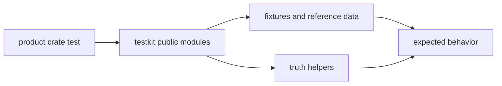

# Public API

`bijux-gnss-testkit` exposes a direct public module surface from `lib.rs`.
The public API is for shared tests and validation support. It must remain
independent enough to catch product regressions instead of mirroring the
implementation under test.

## API Flow

## Public Modules

| module | responsibility |
| --- | --- |
| `antenna` | Antenna-effect truth and synthesis helpers. |
| `fixtures` | Typed fixture and dataset-style loading. |
| `geometry` | Reusable geometric helpers for tests. |
| `position_truth` | Synthetic truth scenario construction and position expectations. |
| `reference_data` | Checked-in public truth assets and derived records. |
| `signal` | Deterministic acquisition and signal synthesis helpers. |

## Internal-Only Surface

`reference_models` is private even though it is central to the crate. Other
crates should consume truth helpers and reference data, not bind themselves to
the implementation details of how test truth is derived.

## Review Checks

- Expose a helper publicly only when multiple crates or test families need it.
- Keep reference-model internals private unless there is a durable cross-crate
  contract.
- Public helpers need provenance or independence rationale in docs or tests.
