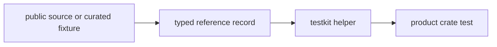

# Reference Data

`bijux-gnss-testkit` owns checked-in reference evidence that multiple GNSS
crates rely on in tests. Reference data is not scratch input; it is reusable
truth with provenance, units, and a clear consumer.

## Reference Data Flow

## Owned Families

| family | responsibility |
| --- | --- |
| station truth | Public or curated station coordinates and derived records used by navigation and positioning tests. |
| troposphere elevation truth | Reference values for correction and model validation across elevation angles. |
| PPP convergence truth | Expected convergence behavior used by precise-positioning tests. |
| coordinate truth | Checked-in coordinate records used when conversion and comparison stability matter. |

## Contract Rules

- Every durable reference record needs provenance or an explicit reason it is
  synthetic.
- Units, coordinate frames, epochs, and time systems must be visible at the
  record or helper boundary.
- Shared reference data must have at least one concrete consumer. If only one
  test needs the input, keep it local to that test unless it represents reusable
  truth.
- Reference data must not depend on command-generated local paths or previous
  run artifacts.

## Review Checks

- Adding a new dataset requires documenting source, unit conventions, and
  intended consumers.
- Updating existing truth requires explaining whether downstream expectations
  changed or the old data was wrong.
- Removing reference data requires checking all crate consumers, not only
  testkit tests.
