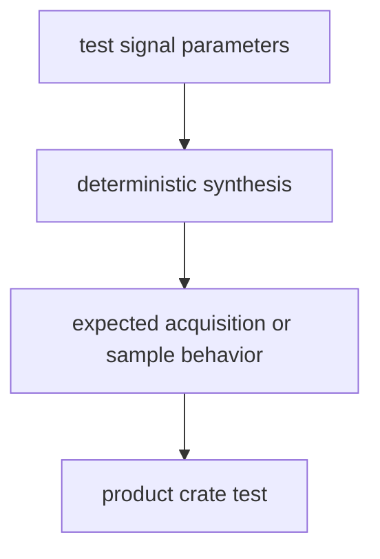

# Signal

`bijux-gnss-testkit` owns deterministic signal-oriented test truth. It helps
tests ask whether acquisition and sample-processing behavior matches an
independent expectation without moving production DSP into the testkit.

## Truth Flow

## Owned Responsibilities

- acquisition expectation helpers for tests that need stable code-phase and
  wrapped-error checks
- deterministic signal-synthesis helpers used by integration tests
- clipped quantized-IQ generation used to validate front-end and raw-sample
  handling
- shared test inputs that are independent from the production helper being
  exercised

## Contract Rules

- Testkit signal truth must not become the canonical production signal catalog.
- A helper used to test production DSP should be simpler and independently
  inspectable, not a re-export of the implementation under test.
- Generated clipped-IQ cases should state what is intentionally saturated and
  what remains valid signal evidence.
- If a fixture starts requiring receiver runtime state, move the runtime concern
  to receiver tests and keep the reusable truth here narrow.

## Not Owned Here

- production code families, replicas, spectra, NCOs, and sample conversions
  belong to `bijux-gnss-signal`
- receiver acquisition and tracking behavior belongs to `bijux-gnss-receiver`
- dataset registration belongs to `bijux-gnss-infra`

## Proof Surfaces

- `src/signal/acquisition.rs`
- `src/signal/synthesis.rs`
- `tests/scientific_independence.rs`
- signal and receiver integration tests that consume testkit fixtures
