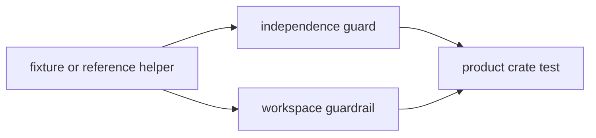

# Tests

`bijux-gnss-testkit` tests protect the crate as a shared truth source. The
tests prove that fixtures, reference helpers, and independent models remain
usable across product crates without reflecting the production implementation
under test.

## Test Flow

## Entry Points

| entrypoint | protects |
| --- | --- |
| `tests/scientific_independence.rs` | Key truth helpers do not call forbidden production navigation helper paths. |
| `tests/integration_guardrails.rs` | The crate stays aligned with workspace guardrails. |
| product crate tests using testkit | Shared fixtures and truth helpers remain useful outside this package. |

## Contract Rules

- Testkit tests should prove independence, determinism, provenance, and
  cross-crate usefulness.
- A shared fixture must have a stable unit, frame, epoch, or coordinate
  convention.
- Truth helpers should be simpler, independent, or source-anchored enough to
  catch product mistakes.
- Testkit must not become a broad bucket for unrelated one-off test setup.

## Review Checks

- New public helpers need direct testkit coverage or product crate coverage that
  exercises the helper.
- New fixtures need provenance and deterministic loading tests when practical.
- If a helper begins depending on the product path it validates, update
  independence docs and add a focused guard.
