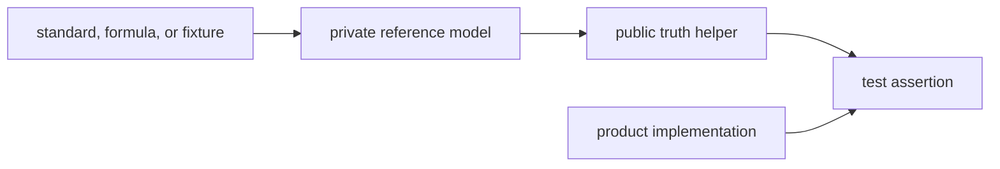

# Truth Models

`bijux-gnss-testkit` computes expected behavior without collapsing back into the
production helper stack under test. Truth models are the reason product tests can
fail when production code is wrong.

## Truth Model Flow

## Owned Responsibilities

| surface | responsibility |
| --- | --- |
| `src/reference_models/` | Private independent implementations used to derive expected behavior. |
| `src/position_truth/` | Scenario truth generation for positioning and navigation tests. |
| `src/antenna/` | Antenna-effect truth helpers and reference calculations. |
| `src/signal/` | Signal and acquisition truth helpers used by higher-level tests. |

## Independence Rules

- Prefer explicit formulas, checked-in reference values, or simpler alternative
  algorithms over production solver calls.
- A truth helper may share core vocabulary types, but it should not reuse the
  product algorithm it is meant to validate.
- If independence is incomplete, document the limitation and add a focused guard
  so readers know what the test can and cannot prove.
- Keep private models private unless callers need a stable truth contract.

## Review Checks

- New truth models need a named source of expected behavior.
- Public truth helpers need at least one concrete product-crate consumer.
- If a helper becomes a wrapper around production logic, move it out of testkit
  or restore independent evidence.
