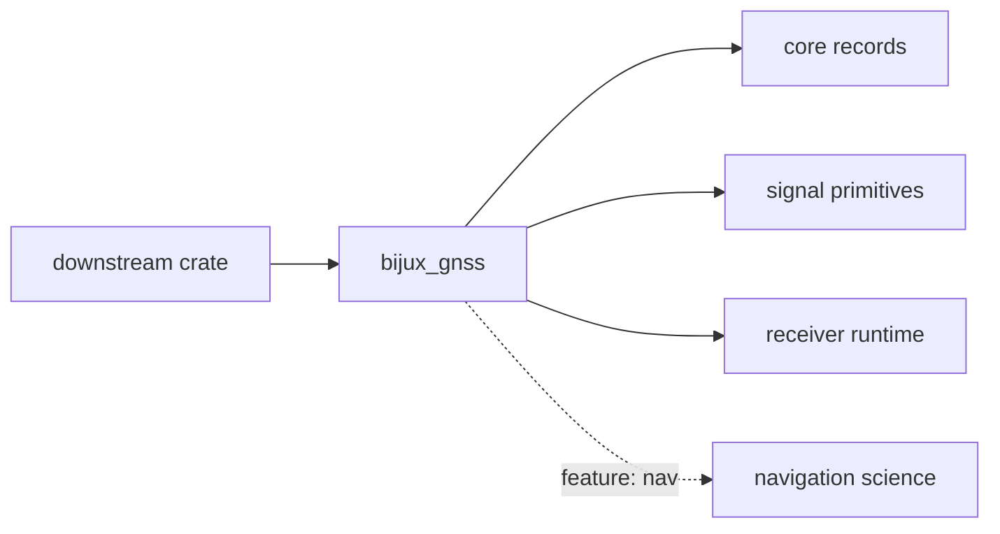

# bijux-gnss API

`bijux-gnss` exposes the public facade crate for the GNSS workspace and the
`bijux` command-line binary. Its Rust API is intentionally narrow: it gives
downstream callers stable crate entrypoints without turning the facade into a
second owner for receiver, signal, navigation, or core science.

## Import Surface

| import | owner reached | use when |
| --- | --- | --- |
| `bijux_gnss::core` | `bijux-gnss-core` | You need shared IDs, units, time, observation records, artifact envelopes, or diagnostics. |
| `bijux_gnss::signal` | `bijux-gnss-signal` | You need signal catalogs, spreading codes, raw-IQ contracts, or DSP primitives. |
| `bijux_gnss::receiver` | `bijux-gnss-receiver` | You need receiver configuration, acquisition, tracking, observations, runtime artifacts, or receiver simulation helpers. |
| `bijux_gnss::nav` | `bijux-gnss-nav`, behind feature `nav` | You need navigation products, correction models, positioning, RTK, PPP, or estimator evidence. |

## What The Facade Owns

- Re-exporting the stable package entrypoints a downstream Rust user expects.
- Keeping the `nav` feature boundary visible at the first import site.
- Avoiding duplicate API policy that belongs to the owning crates.
- Matching the public binary story: the facade introduces the stack, then hands
  work to the crates that own it.

## What It Does Not Own

- Receiver stage behavior, runtime configuration semantics, or tracking state.
- Signal math, spreading-code generation, front-end models, or raw-IQ metadata.
- Navigation correction science, solution estimation, ambiguity handling, or
  precise-product parsing.
- Artifact layout, dataset registry, or repository run persistence.

## Reader Guidance

Use this crate when you want one top-level package dependency and the owning
crate module is still clear in the import path. If a reader needs detailed
contracts, send them to the owning package reference:

- [core API](../bijux-gnss-core/API.md)
- [signal API](../bijux-gnss-signal/API.md)
- [receiver API](../bijux-gnss-receiver/API.md)
- [navigation API](../bijux-gnss-nav/API.md)

## Review Checks

- New facade exports must point at an owning crate instead of introducing new
  domain logic here.
- Feature-gated surfaces must keep their feature requirement visible in
  documentation and Rust attributes.
- Command-line behavior belongs in [docs/COMMANDS.md](docs/COMMANDS.md) and
  [docs/EXECUTION.md](docs/EXECUTION.md), not in this API reference.
