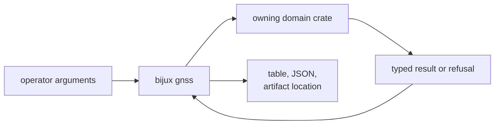

# bijux-gnss

[](https://crates.io/crates/bijux-gnss)
[](https://github.com/bijux/bijux-gnss/blob/main/LICENSE)
[](https://github.com/bijux/bijux-gnss)
[](https://crates.io/crates/bijux-gnss)
[](https://github.com/bijux/bijux-gnss/pkgs/container/bijux-gnss%2Fbijux-gnss)
[](https://docs.rs/bijux-gnss/latest/bijux_gnss/)
[](https://github.com/bijux/bijux-gnss/tree/main/docs/bijux-gnss)

`bijux-gnss` is the front door to the bijux GNSS stack. Install it for the
`bijux gnss` command, or depend on it when a Rust application wants the core,
signal, receiver, and optional navigation crates behind one package.

It is intentionally thin. Receiver algorithms, signal definitions, navigation
science, datasets, and persisted run layout remain in their owning crates.

## Pick The Interface You Need

### Run a workflow

The binary accepts operator input, delegates domain work, and presents the
result as a table or JSON. Before the first registry release, run it from this
workspace:

```console
cargo run -q -p bijux-gnss -- gnss --help
cargo run -q -p bijux-gnss -- gnss inspect \
  --dataset demo_synthetic \
  --report json \
  --out artifacts/inspect_demo
```

The inspect command resolves a registered dataset and writes reviewable
evidence. It does not imply that acquisition, tracking, or positioning ran.
Choose a command by the claim you need:

| Claim or operation | Read next |
| --- | --- |
| inspect, ingest, acquire, track, run, replay, or diagnose | [Command reference](docs/COMMANDS.md) |
| export or validate synthetic IQ and navigation scenarios | [Validation behavior](docs/VALIDATION.md) |
| understand input resolution and lower-crate handoff | [Execution model](docs/EXECUTION.md) |
| consume table, JSON, and artifact output correctly | [Reporting contract](docs/REPORTING.md) |
| compose several commands into a reproducible run | [Workflow guide](docs/WORKFLOWS.md) |



The command may sequence lower-level calls, but it does not reinterpret their
scientific meaning. An acquisition candidate is not reported as accepted
unless the receiver accepted it, and a navigation refusal remains a refusal in
the command output.

### Import the Rust facade

The library exposes crate modules rather than duplicating their APIs:

```rust
use bijux_gnss::core::api::{Constellation, SatId};

let satellite = SatId {
    constellation: Constellation::Gps,
    prn: 11,
};
```

The other unconditional module paths are `bijux_gnss::signal` and
`bijux_gnss::receiver`. Navigation is available as `bijux_gnss::nav` only when
the `nav` feature is enabled. Import a focused package directly when your
application uses one domain heavily or needs the clearest feature control. The
[facade contract](docs/FACADE.md) explains why this package does not add
cross-domain convenience APIs.

## Features Change The Available Surface

| Feature | What becomes available |
| --- | --- |
| `cli` | the `bijux` binary, command parsing, workflows, and reports |
| `nav` | the navigation facade and receiver navigation support |
| `precise-products` | CLI support plus navigation and precise-product handling |
| `tracing` | command-side tracing setup |
| `schema-validate` | JSON Schema generation and validation commands |
| `plots` | bitmap plot output for analysis commands |

Default features are `cli` and `precise-products`. Because
`precise-products` enables `cli` and `nav`, a default build includes the
command and navigation. A library-only consumer can begin with:

```toml
[dependencies]
bijux-gnss = { version = "0.1.0", default-features = false }
```

The first registry release has not been published yet; the dependency example
describes the prepared release surface. Use the workspace dependency while
developing in this repository.

## Know Which Contract You Are Changing

- Command names, options, defaults, top-level sequencing, and presentation
  belong here.
- Acquisition, tracking, observations, and receiver runtime behavior belong to
  the [receiver package](../bijux-gnss-receiver/README.md).
- Codes, replicas, sample conversion, and DSP belong to the
  [signal package](../bijux-gnss-signal/README.md).
- Product parsing, corrections, estimation, and integrity belong to the
  [navigation package](../bijux-gnss-nav/README.md).
- Dataset identity, provenance, manifests, and persisted run layout belong to
  the [infrastructure package](../bijux-gnss-infra/README.md).

Compatibility changes are recorded in the
[package release history](CHANGELOG.md). The
[architecture guide](docs/ARCHITECTURE.md) and
[test evidence guide](docs/TESTS.md) connect each public behavior to its
implementation and proof surface.
