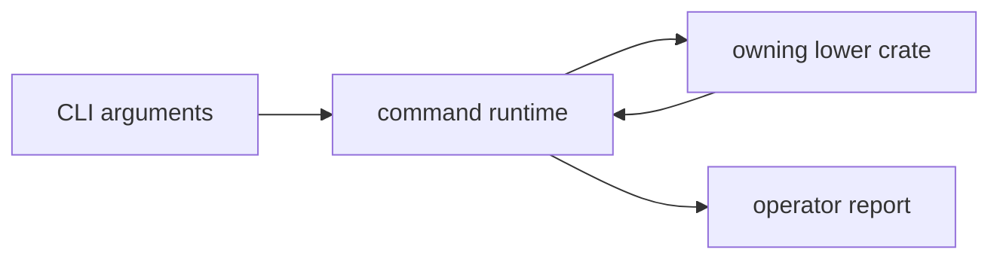

# bijux-gnss

[](https://crates.io/crates/bijux-gnss)
[](https://github.com/bijux/bijux-telecom/blob/main/LICENSE)
[](https://github.com/bijux/bijux-telecom)
[](https://crates.io/crates/bijux-gnss)
[](https://github.com/bijux/bijux-telecom/pkgs/container/bijux-telecom%2Fbijux-gnss)
[](https://docs.rs/bijux-gnss/latest/bijux_gnss/)
[](https://github.com/bijux/bijux-telecom/tree/main/docs/01-bijux-gnss)

`bijux-gnss` is the operator and integration entrypoint for the GNSS workspace.
It provides the `bijux` command and a thin Rust facade over the public core,
signal, receiver, and optional navigation APIs.

Use the command for complete workflows and machine-readable reports. Depend on
the facade when an application needs several GNSS crates through one package.
Choose a lower crate directly when only one domain API is required.

## Use From This Checkout

The first release has not been published. Run the command from the workspace:

```sh
cargo run -q -p bijux-gnss -- gnss --help
```

After publication, the registry package will support:

```sh
cargo install bijux-gnss
cargo add bijux-gnss
```

The Cargo package name is `bijux-gnss`; its Rust import name is `bijux_gnss`.

## Choose the Surface

| need | use |
| --- | --- |
| invoke acquisition, validation, synthetic, or navigation workflows | `bijux gnss ...` and the [command guide](docs/COMMANDS.md) |
| understand command execution and lower-crate handoff | [execution guide](docs/EXECUTION.md) |
| consume stable command reports | [reporting guide](docs/REPORTING.md) |
| import the combined Rust surface | [facade guide](docs/FACADE.md) and [public API guide](docs/PUBLIC_API.md) |
| assess compatibility or release impact | [package release history](CHANGELOG.md) |

## Owned Boundary

- command names, arguments, and top-level workflow composition
- runtime setup before handing work to lower-level crates
- operator-facing report rendering and command result presentation
- the narrow [facade export surface](src/lib.rs) over lower-level GNSS crates

This crate does not own low-level signal implementations, standalone navigation
science, receiver-stage internals, or repository persistence contracts.



## Features

| feature | effect |
| --- | --- |
| `cli` | builds command parsing, workflow execution, and reports |
| `nav` | exposes navigation APIs and enables receiver navigation |
| `precise-products` | enables CLI and navigation support for precise products |
| `tracing` | enables command-side tracing setup |
| `schema-validate` | enables JSON Schema generation and validation |
| `plots` | enables bitmap plot output |

Default features are `cli` and `precise-products`; precise-product support also
enables navigation. Applications that only need the facade can disable defaults
and select features explicitly.

## Implementation Ownership

- The [binary entrypoint](src/main.rs) assembles the command surface.
- The [argument parser](src/cli/command_line.rs) owns command names, options,
  and defaults.
- The [command runtime](src/cli/command_runtime.rs) and
  [execution support](src/cli/execution_support.rs) assemble workflows and
  lower-crate handoffs.
- The [report renderer](src/cli/report.rs) owns operator-facing output.
- The [facade export surface](src/lib.rs) owns public re-exports.

For design boundaries, continue with the [architecture guide](docs/ARCHITECTURE.md)
and [contract guide](docs/CONTRACTS.md). For operating behavior, use the
[workflow guide](docs/WORKFLOWS.md), [validation guide](docs/VALIDATION.md), and
[test guide](docs/TESTS.md).

## Verification Focus

Use package tests for command semantics before reaching for the full workspace:

```sh
cargo test -p bijux-gnss --test integration_validate_config
cargo test -p bijux-gnss --test integration_nav_decode
cargo test -p bijux-gnss --test integration_validate_synthetic_navigation
```

Repository-wide lanes and package routing are documented in the
[workspace README](../../README.md).
