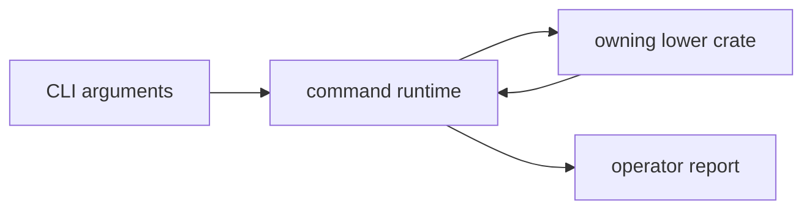

# bijux-gnss

`bijux-gnss` owns the public package facade and the `bijux` binary. Start here
when the question is about an operator workflow, command arguments, report
format, or the thin Rust facade that downstream users see first.

It should stay thin. The crate composes lower-level GNSS crates; it must not
absorb their science, persistence rules, or runtime internals.

## Reader Route

| question | go next |
| --- | --- |
| Which command or argument exists? | [docs/COMMANDS.md](docs/COMMANDS.md), `src/cli/command_line.rs` |
| How does a command assemble work? | [docs/EXECUTION.md](docs/EXECUTION.md), `src/cli/command_runtime.rs` |
| What does a report promise to operators? | [docs/REPORTING.md](docs/REPORTING.md), `src/cli/report.rs` |
| What does the Rust facade expose? | [docs/FACADE.md](docs/FACADE.md), [docs/PUBLIC_API.md](docs/PUBLIC_API.md), `src/lib.rs` |
| What changed in this package? | [CHANGELOG.md](CHANGELOG.md) |

## Owned Boundary

- command names, arguments, and top-level workflow composition
- runtime setup before handing work to lower-level crates
- operator-facing report rendering and command result presentation
- the narrow `src/lib.rs` facade over lower-level GNSS crates

This crate does not own low-level signal implementations, standalone navigation
science, receiver-stage internals, or repository persistence contracts.



## Source Map

- `src/main.rs` assembles the binary command surface.
- `src/cli/command_line.rs` owns command parsing and stable argument shape.
- `src/cli/command_runtime.rs` and `src/cli/execution_support.rs` own runtime
  setup and workflow support.
- `src/cli/report.rs` owns operator-facing output rendering.
- `src/lib.rs` owns the package facade over lower-level crates.

## Documentation Map

- [docs/ARCHITECTURE.md](docs/ARCHITECTURE.md)
- [docs/BOUNDARY.md](docs/BOUNDARY.md)
- [docs/COMMANDS.md](docs/COMMANDS.md)
- [docs/CONTRACTS.md](docs/CONTRACTS.md)
- [docs/EXECUTION.md](docs/EXECUTION.md)
- [docs/FACADE.md](docs/FACADE.md)
- [docs/PUBLIC_API.md](docs/PUBLIC_API.md)
- [docs/REPORTING.md](docs/REPORTING.md)
- [docs/TESTS.md](docs/TESTS.md)
- [docs/VALIDATION.md](docs/VALIDATION.md)
- [docs/WORKFLOWS.md](docs/WORKFLOWS.md)

## Verification Focus

Use package tests for command semantics before reaching for the full workspace:

```sh
cargo test -p bijux-gnss --test integration_validate_config
cargo test -p bijux-gnss --test integration_nav_decode
cargo test -p bijux-gnss --test integration_validate_synthetic_navigation
```

Repository-wide lanes and package routing are documented in
[../../README.md](../../README.md).
