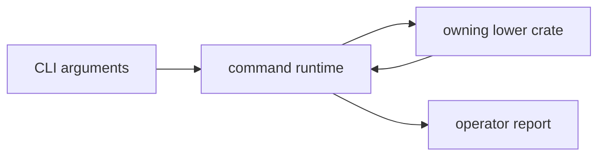

# bijux-gnss

[](https://crates.io/crates/bijux-gnss)
[](https://github.com/bijux/bijux-telecom/blob/main/LICENSE)
[](https://github.com/bijux/bijux-telecom)
[](https://crates.io/crates/bijux-gnss)
[](https://github.com/bijux/bijux-telecom/pkgs/container/bijux-telecom%2Fbijux-gnss)
[](https://docs.rs/bijux-gnss/latest/bijux_gnss/)
[](https://github.com/bijux/bijux-telecom/tree/main/docs/01-bijux-gnss)

`bijux-gnss` owns the public package facade and the `bijux` binary. Start here
when the question is about an operator workflow, command arguments, report
format, or the thin Rust facade that downstream users see first.

The crate composes the lower-level GNSS packages without absorbing their
signal science, navigation algorithms, persistence rules, or receiver runtime
internals.

## Install

Install the `bijux` command:

```sh
cargo install bijux-gnss
```

Add the facade library to a Rust package:

```sh
cargo add bijux-gnss
```

The Cargo package name is `bijux-gnss`; its Rust import name is `bijux_gnss`.

## Reader Route

| question | go next |
| --- | --- |
| Which command or argument exists? | [Command guide](docs/COMMANDS.md), `src/cli/command_line.rs` |
| How does a command assemble work? | [Execution guide](docs/EXECUTION.md), `src/cli/command_runtime.rs` |
| What does a report promise to operators? | [Reporting guide](docs/REPORTING.md), `src/cli/report.rs` |
| What does the Rust facade expose? | [Facade guide](docs/FACADE.md), [Public API](docs/PUBLIC_API.md), `src/lib.rs` |
| What changed in this package? | [Package changelog](CHANGELOG.md) |

## Owned Boundary

- command names, arguments, and top-level workflow composition
- runtime setup before handing work to lower-level crates
- operator-facing report rendering and command result presentation
- the narrow `src/lib.rs` facade over lower-level GNSS crates

This crate does not own low-level signal implementations, standalone navigation
science, receiver-stage internals, or repository persistence contracts.



## Source Map

- `src/main.rs` assembles the binary command surface.
- `src/cli/command_line.rs` owns command parsing and stable argument shape.
- `src/cli/command_runtime.rs` and `src/cli/execution_support.rs` own runtime
  setup and workflow support.
- `src/cli/report.rs` owns operator-facing output rendering.
- `src/lib.rs` owns the package facade over lower-level crates.

## Documentation Map

- [Architecture guide](docs/ARCHITECTURE.md)
- [Boundary guide](docs/BOUNDARY.md)
- [Command guide](docs/COMMANDS.md)
- [Contract guide](docs/CONTRACTS.md)
- [Execution guide](docs/EXECUTION.md)
- [Facade guide](docs/FACADE.md)
- [Public API](docs/PUBLIC_API.md)
- [Reporting guide](docs/REPORTING.md)
- [Test guide](docs/TESTS.md)
- [Validation guide](docs/VALIDATION.md)
- [Workflow guide](docs/WORKFLOWS.md)

## Verification Focus

Use package tests for command semantics before reaching for the full workspace:

```sh
cargo test -p bijux-gnss --test integration_validate_config
cargo test -p bijux-gnss --test integration_nav_decode
cargo test -p bijux-gnss --test integration_validate_synthetic_navigation
```

Repository-wide lanes and package routing are documented in the
[workspace README](../../README.md).
