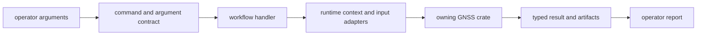
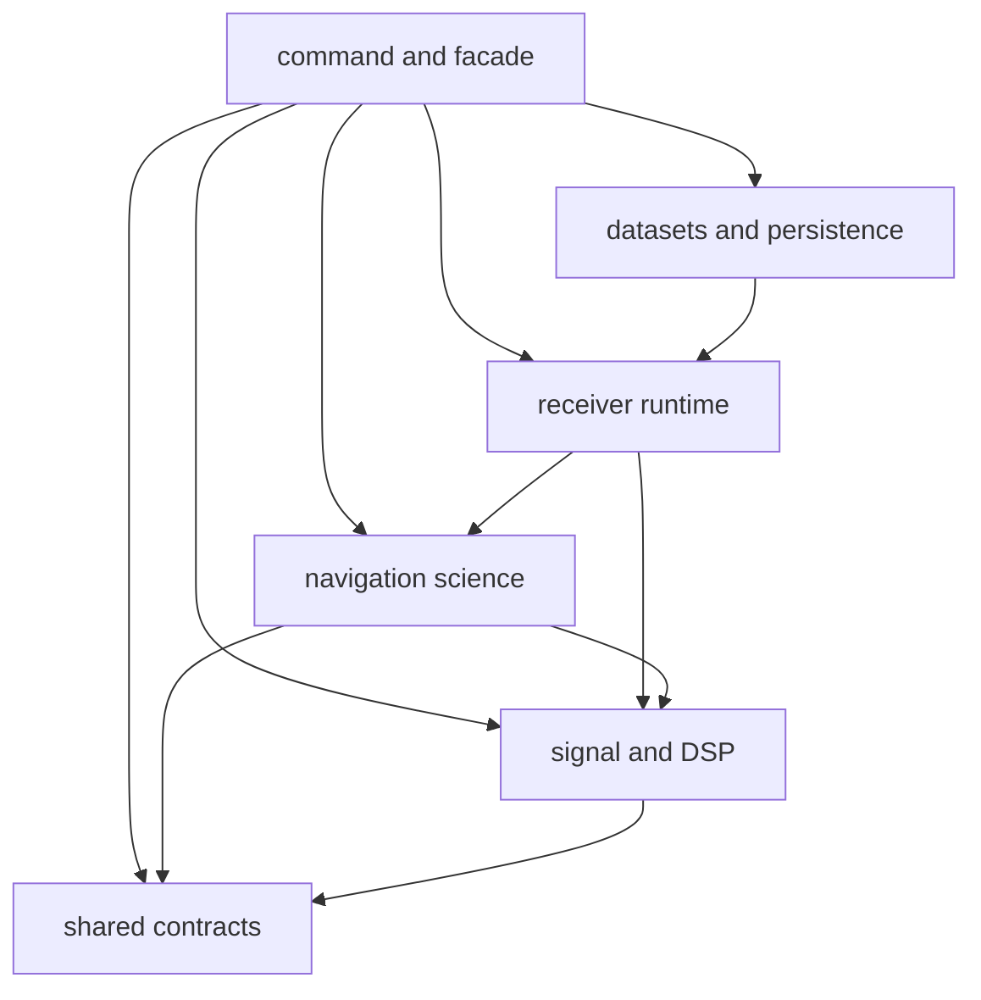

# Architecture

`bijux-gnss` turns operator intent into calls to the crate that owns the
requested GNSS behavior. It owns command syntax, orchestration, and report
presentation. It does not own signal, receiver, navigation, or persistence
algorithms.

## Request Lifecycle

The command layer may validate operator input and assemble a workflow, but a
successful command must still expose the evidence and refusal behavior returned
by its lower-level owner.

## Ownership Boundaries

| responsibility | owner |
| --- | --- |
| process entry and top-level dispatch | [binary entrypoint](../src/main.rs) |
| command names, options, defaults, and argument groups | [command catalog](../src/cli/command_catalog/mod.rs) and [argument parser](../src/cli/command_line.rs) |
| ingest, synthetic, pipeline, artifact, diagnostic, analysis, and validation workflows | [command handlers](../src/cli/commands/mod.rs) |
| runtime setup, dataset inspection, and workflow reporting context | [command runtime](../src/cli/command_runtime.rs) |
| artifact loading, capture windows, lower-crate output adaptation, and quality support | [command support](../src/cli/command_support/mod.rs) |
| operator-facing text and machine-readable report rendering | [report renderer](../src/cli/report.rs) |
| combined Rust imports for downstream applications | [facade exports](../src/lib.rs) |

## Dependency Direction

Lower crates never depend on this command package. A command handler that starts
implementing DSP, receiver state, navigation estimation, or repository layout
has crossed the boundary.

## Evidence and Failure

- Invalid arguments fail before workflow execution and identify the rejected
  operator input.
- Runtime setup failures preserve dataset, configuration, or environment
  context.
- Lower-crate refusals remain typed until report rendering; the CLI must not
  turn a scientific refusal into a generic success or vague error.
- Commands that write files return the governed artifact or run location and
  enough metadata for later inspection.

The [contract guide](CONTRACTS.md) defines stable command-facing behavior, and
the [execution guide](EXECUTION.md) explains workflow handoff in more detail.

## Architectural Evidence

- [Command integration coverage](../tests/integration_validate_config.rs)
  protects configuration and report behavior.
- [Synthetic export coverage](../tests/integration_export_synthetic_iq.rs)
  protects command-to-artifact handoff.
- [Navigation decode coverage](../tests/integration_nav_decode.rs) protects
  command routing into navigation behavior.
- [Package guardrails](../tests/integration_guardrails.rs) protect dependency
  direction and repository conventions.
