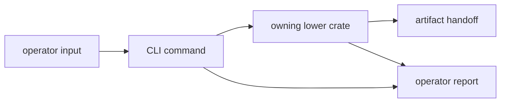

# Boundary

Owner: operator CLI workflows and top-level package facade

`bijux-gnss` is the human and downstream-entry boundary. It turns operator
intent into calls across lower-level crates, then renders results back as
commands, reports, and a narrow Rust facade.

## Boundary Flow

## Owned Scope

`bijux-gnss` owns:

- the `bijux` binary target
- command-line parsing and stable command shape
- command orchestration over lower-level crates
- report rendering and operator-oriented output shape
- top-level curated crate re-exports from `lib.rs`

## Out Of Scope

- low-level signal implementations
- navigation estimation internals
- receiver stage internals and runtime engine ownership
- repository run-layout rules and artifact persistence contracts

## Dependency Rule

This crate is allowed to depend downward on the product and infrastructure
crates because it is the operator boundary. Those crates must not depend upward
on the CLI.

## Effect Model

This crate owns command-facing effects such as reading configs, selecting
outputs, and rendering reports. The lower-level rules for persisted artifacts
and runtime execution still belong to their owning crates.

## Review Checks

- Does the command delegate science, runtime, and persistence to the owning
  crate instead of reimplementing it?
- Is report wording stable enough for an operator and script reader?
- Does a facade export make downstream use clearer without exposing internals?
