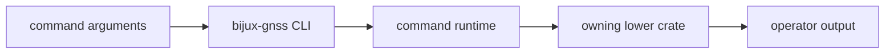

# Commands

This file is the command-family reference for the `bijux` binary. It describes
which workflows the CLI owns and which lower crate owns the behavior behind each
workflow.

## Command Flow

## Top-Level Command Family

- `bijux gnss ...`

## Stable Workflow Families

| family | CLI ownership | lower-crate ownership |
| --- | --- | --- |
| acquisition and capture inspection | Command shape, input paths, report selection. | Receiver acquisition, signal metadata, infra dataset handling. |
| run-pipeline | Runtime setup, profile selection, operator report. | Receiver pipeline behavior and infra run layout. |
| artifact validation and explanation | User command shape and result presentation. | Core schemas and infra artifact inspection. |
| synthetic signal generation and export | Command routing and output options. | Signal DSP and receiver simulation helpers. |
| navigation-format and RINEX workflows | Input selection and report wording. | Navigation product parsing and writer behavior. |
| configuration validation and diagnostics | Operator-facing validation output. | Core, receiver, nav, and infra validation contracts. |
| analysis and comparison | Command routing and report shape. | Owning crate comparison or validation logic. |

## Review Checks

- New commands need an owned workflow family and a lower-crate handoff.
- Flag names should describe operator intent, not internal helper names.
- A command that writes files needs artifact or run-layout docs updated in the
  owning crate.
