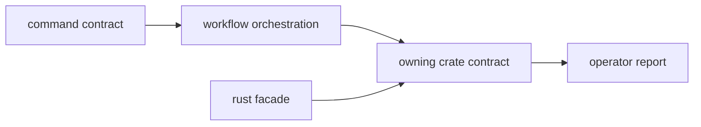

# Contracts

`bijux-gnss` owns operator command contracts and facade routing contracts. It
does not own foundational scientific contracts; those belong to the lower crates
that implement and validate the domain behavior.

## Contract Flow

## Command Contract

This crate owns the stable shape of:

- command families
- arguments and flags
- report-format switches
- operator-facing success and failure output
- top-level validation and routing behavior

## Orchestration Contract

Commands assemble lower-level crates into user-facing workflows. This package
owns the sequence and presentation of that workflow, not the scientific behavior
of the lower-level crates.

## Facade Contract

`src/lib.rs` owns a narrow package-level facade over lower-level GNSS crates.
The facade is a package convenience, not a new mixed-ownership domain.

## Review Checks

- If a lower-crate contract changes, update the command docs only where operator
  behavior changes.
- If a command changes output, update the [reporting guide](REPORTING.md).
- If facade imports change, update the [facade guide](FACADE.md) and
  [public API](PUBLIC_API.md).
