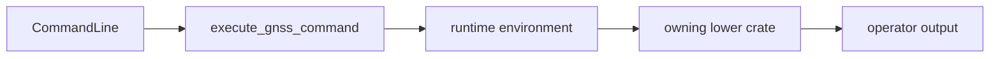

# Execution

`bijux-gnss` owns operator-facing execution setup. It turns parsed command
arguments into calls against lower-level crates, then returns operator-visible
results. It does not own the scientific or persistence semantics of the crates
it invokes.

## Execution Flow

## Owned Responsibilities

- command dispatch from `ApplicationCommand::Gnss`
- runtime setup derived from command arguments and environment
- capture-start and runtime configuration helpers used before receiver handoff
- command-level sequencing of dataset inspection, acquisition, tracking,
  navigation, validation, artifact inspection, and synthetic workflows
- table and JSON report handoff after lower-level crates return typed results

## Contract Rules

- Execution code may choose which lower-level crate is called first; it may not
  redefine what that crate's result means.
- Runtime defaults must be visible in command docs or receiver/infra docs before
  operators are expected to rely on them.
- A command that writes files must route through infrastructure-owned run layout
  or an explicit user-provided output path.
- Validation commands should return lower-level refusal evidence, not collapse
  it into a generic success or failure message.

## Not Owned Here

- acquisition, tracking, observations, and receiver state belong to
  `bijux-gnss-receiver`
- signal catalogs, sample conversion, and DSP primitives belong to
  `bijux-gnss-signal`
- navigation products, corrections, estimators, and refusal science belong to
  `bijux-gnss-nav`
- dataset registry and persisted run layout belong to `bijux-gnss-infra`

## Proof Surfaces

- `src/cli/command_runtime.rs`
- `src/cli/execution_support.rs`
- `src/cli/command_line.rs`
- command integration tests under `crates/bijux-gnss/tests/`
