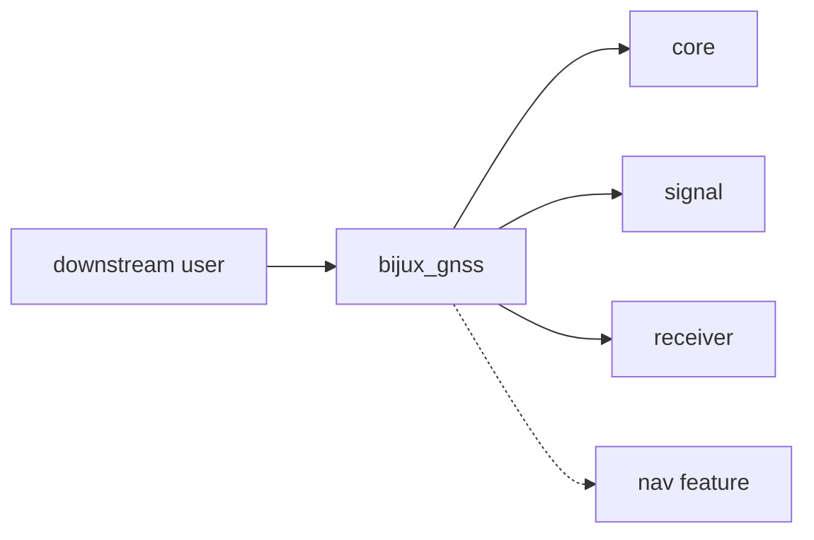

# Facade

`bijux-gnss` exposes a narrow package-level Rust facade in addition to its
operator CLI. The facade lets downstream Rust users start from one package while
keeping ownership visible through re-exported crate modules.

## Facade Flow

## Owned Responsibilities

| surface | responsibility |
| --- | --- |
| `src/lib.rs` | Re-exports the package modules that form the public Rust entrypoint. |
| feature-gated `nav` export | Makes navigation availability explicit at the facade boundary. |
| package documentation | Tells readers which owning crate they should inspect next. |

## Boundary Rules

- The facade should stay narrow and explicit.
- Re-export lower-level crate surfaces deliberately; do not add bespoke helper
  functions that blur package ownership.
- If a capability is owned by `core`, `signal`, `receiver`, `nav`, or `infra`,
  improve the owning crate instead of growing facade logic.
- CLI command behavior belongs in command docs, not in the Rust facade contract.

## Reader Guidance

Use the facade for simple imports and for discoverability. Import the owning
crate directly when a caller needs deep API coverage, feature-specific behavior,
or documentation for a domain contract.

## Review Checks

- A new facade export needs a durable downstream-user reason.
- Feature-gated exports need matching docs and Rust attributes.
- The facade must not become a mixed-responsibility library that duplicates
  lower-crate APIs.
