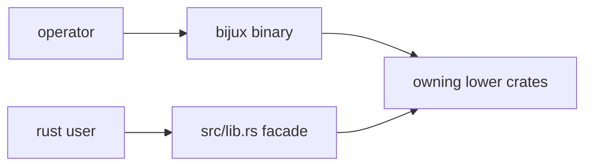

# Public API

`bijux-gnss` has two public surfaces: the `bijux` command-line binary and the
small Rust facade exposed from `src/lib.rs`. They serve different readers and
must not be collapsed into one mixed-responsibility API.

## Public Surface Flow

## Binary Surface

The binary owns operator workflows:

- command names and subcommand families
- argument and flag structure
- report-format selection
- user-facing success, failure, and validation output
- top-level orchestration of lower-crate calls

## Rust Surface

`src/lib.rs` exposes a narrow facade:

- `core`
- `receiver`
- `signal`
- `nav` when the `nav` feature is enabled

The facade exists for package discoverability and simple imports. It is not a
home for bespoke helpers that belong to lower crates.

## Review Checks

- A new command needs a documented workflow and an owning lower-crate handoff.
- A new Rust export needs a downstream-user reason and visible owner.
- Feature-gated exports need documentation that matches the Rust feature gate.
- Operator output changes belong in reporting and command docs, not only tests.
