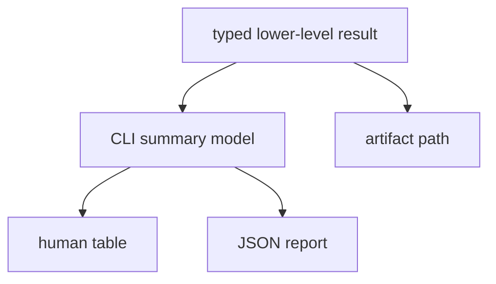

# Reporting

`bijux-gnss` owns operator-facing report rendering. Reports are presentation
surfaces over typed lower-level results; they must make evidence easier to read
without changing the meaning of the evidence.

## Report Flow

## Owned Responsibilities

- report-format selection and command-level rendering
- concise human summaries for acquisition, tracking, validation, synthetic IQ,
  quantization, navigation accuracy, and artifact inspection workflows
- JSON report shape at the command boundary when the command, not a lower crate,
  owns the presentation wrapper
- stable field names for command-level summaries such as reported PRNs, tracked
  PRNs, navigation attempts, and position attempts

## Contract Rules

- Reports may summarize lower-layer results, but they must preserve identifiers,
  units, refusal reasons, and artifact paths.
- A report must not label a candidate as accepted unless the lower-level result
  carries that status.
- Human tables can omit detail for readability only when JSON or artifact output
  still carries the detail.
- Report sorting must be deterministic so repeated runs are reviewable.
- Paths printed to operators should be the paths they can inspect next.

## Not Owned Here

- receiver artifact schemas belong to `bijux-gnss-receiver` and
  `bijux-gnss-core`
- run directories, manifests, and persisted evidence layout belong to
  `bijux-gnss-infra`
- scientific accuracy thresholds belong to receiver or navigation validation
  surfaces

## Proof Surfaces

- `src/cli/report.rs`
- `src/cli/command_runtime/acquisition_reporting.rs`
- `src/cli/command_runtime/synthetic_reporting.rs`
- report-focused integration tests under `crates/bijux-gnss/tests/`
