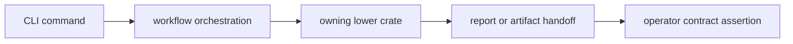

# Tests

`bijux-gnss` tests protect operator workflow wiring and facade behavior. They do
not replace the scientific or runtime tests in receiver, signal, navigation,
core, or infrastructure crates.

## Test Flow



## Entry Points

| family | protects |
| --- | --- |
| acquisition and synthetic signal workflows | Commands stay wired to signal and receiver surfaces. |
| raw-IQ metadata and front-end metrics | Capture workflows route metadata and diagnostics correctly. |
| navigation decode and RINEX workflows | CLI handoff to navigation parsing remains stable. |
| capture, config, synthetic IQ, synthetic navigation, and bias validation | Operator validation commands preserve readable failures and artifact handoff. |
| guardrails | The crate stays aligned with workspace structure policy. |

## Contract Rules

- CLI tests should assert command behavior a user can observe.
- Lower-crate scientific correctness belongs in the owning crate's tests.
- Report tests should check stable fields and reader-actionable failures.
- Workflow tests should prove routing and handoff, not private helper layout.

## Verification

Useful commands from the repository root:

```sh
cargo test -p bijux-gnss --test integration_validate_config
cargo test -p bijux-gnss --test integration_nav_decode
cargo test -p bijux-gnss --test integration_validate_synthetic_navigation
```
