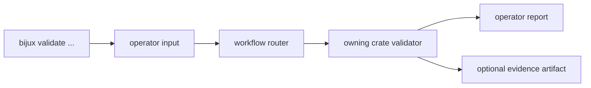

# Validation

`bijux-gnss` owns the operator-facing validation workflows exposed by the
`bijux` binary. The CLI decides how a validation command is invoked, how input
paths are named, how failures are reported to a human, and which lower crate
receives each domain-specific check.

It does not own the science behind receiver, signal, navigation, or persisted
artifact validation. Its job is to route validation cleanly and preserve
operator context.

## Validation Flow

## Owned Workflows

| workflow family | CLI responsibility | domain owner |
| --- | --- | --- |
| capture and raw IQ | Parse user paths, dataset names, and reporting options. | `bijux-gnss-signal` for sample metadata; `bijux-gnss-receiver` for receiver behavior; `bijux-gnss-infra` for dataset and artifact layout. |
| configuration | Load operator-provided config, surface schema failures, and keep command wording stable. | `bijux-gnss-core` for shared config contracts; `bijux-gnss-receiver` and `bijux-gnss-nav` for runtime-specific settings. |
| synthetic IQ | Route generated or checked-in synthetic inputs into receiver validation. | `bijux-gnss-receiver` and `bijux-gnss-signal`. |
| synthetic navigation | Present navigation validation commands and human-readable summaries. | `bijux-gnss-nav` for solution science and refusal evidence. |
| bias and reference data | Accept user-selected reference inputs and report comparison outcomes. | `bijux-gnss-infra`, `bijux-gnss-nav`, and `bijux-gnss-testkit` depending on source. |

## Report Contract

- Every validation failure must tell the operator what input failed and which
  contract rejected it.
- A command must not claim scientific validity when the lower crate returned a
  refusal, degraded status, or missing prerequisite.
- Paths printed by the CLI must be inspectable from the repository root or the
  current operator context.
- Machine-readable evidence belongs in artifacts; prose reports summarize the
  result without replacing typed output.

## Review Checks

- New validation commands need a clear owning crate for the actual validation
  logic.
- New flags must describe operator intent, not internal implementation knobs.
- Any new artifact written by a validation command must be documented in the
  owning artifact or infrastructure docs.
