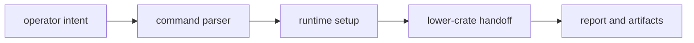

# Workflows

`bijux-gnss` owns operator-facing workflow composition across the lower-level
GNSS crates. A workflow is the sequence a user experiences; each scientific,
runtime, or persistence decision still belongs to the crate that owns that
domain.

## Workflow Flow

## Workflow Families

| family | what the CLI owns |
| --- | --- |
| acquisition and capture inspection | User-facing inputs, selected reports, and handoff to receiver/signal/infra. |
| run-pipeline execution | Runtime setup, profile selection, and top-level status reporting. |
| artifact validation, explanation, and conversion | Command UX and presentation of typed validation results. |
| synthetic signal generation and export | Operator controls and output routing. |
| navigation decode and RINEX-oriented flows | Input selection and user-facing decode/write reports. |
| configuration validation and diagnostics | Human-readable validation failure and diagnostic routing. |
| analysis and comparison over produced runs and artifacts | Workflow composition over existing evidence. |

## What The CLI Does Not Own

- Signal and DSP behavior.
- Receiver stage math and lock lifecycle.
- Navigation solver semantics.
- Persisted run-layout and manifest contracts.

## Review Checks

- Workflows should remain readable from command docs without requiring a reader
  to inspect private helper modules first.
- If a lower-crate handoff changes, update this file only when operator sequence
  or ownership changes.
- Do not move scientific logic into the CLI just because a workflow starts there.
