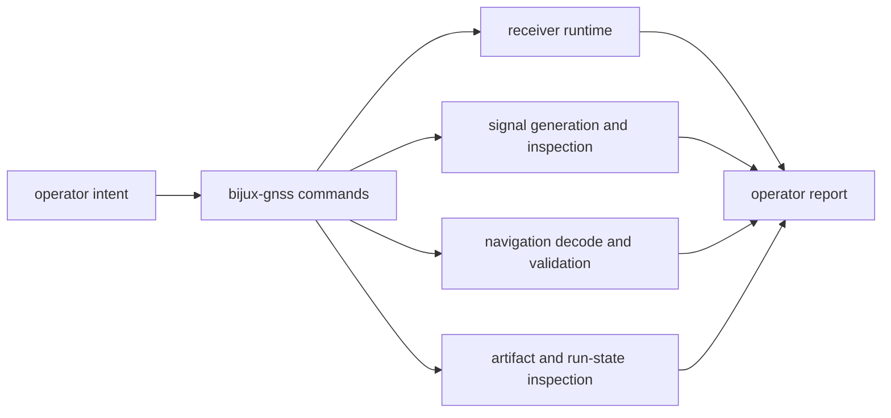

# Architecture Risks

`bijux-gnss` is the operator entrypoint. Its risk is not algorithmic depth; its
risk is becoming a place where lower-owner behavior is quietly renamed,
rewrapped, or re-owned because the command is the first thing a user sees.

## Command Boundary Map

The command crate owns names, flags, sequencing, and report presentation. It
does not own the scientific or repository meaning that lower crates return.

## Highest-Risk Changes

- the crate sits at the top of the stack, so convenience pressure can slowly
  erase lower-owner boundaries
- included CLI modules in `main.rs` can make the command surface feel flatter
  than it really is
- support helpers can attract repository or runtime logic simply because they
  are nearby
- the Rust facade can quietly grow into a mixed-responsibility library
- operator reporting can start embedding lower-owner policy instead of only
  presenting it

## Review Triage

| change shape | command-owned part | likely lower owner |
| --- | --- | --- |
| new flag or subcommand | user-facing name, argument parsing, workflow selection, output shape | lower crate that performs the behavior |
| new validation command | when the operator asks for validation and how the result is reported | `bijux-gnss-core`, `bijux-gnss-receiver`, `bijux-gnss-nav`, or `bijux-gnss-infra` depending on validated meaning |
| new synthetic flow | operator route, file naming at the command surface, report summary | `bijux-gnss-signal` for signal facts, `bijux-gnss-receiver` for runtime proof |
| new artifact report | operator display and high-level explanation | `bijux-gnss-infra` for persisted interpretation, lower producer for artifact meaning |
| new facade export | stable import convenience only after ownership is already clear | crate that owns the exported behavior |

## Proof To Request

- `crates/bijux-gnss/docs/COMMANDS.md` when command names, flags, or workflow
  families change.
- `crates/bijux-gnss/docs/WORKFLOWS.md` when the command sequence or lower-crate
  handoff changes.
- `crates/bijux-gnss/docs/REPORTING.md` when user-facing output changes.
- `crates/bijux-gnss/docs/FACADE.md` and `PUBLIC_API.md` when Rust exports
  change.
- `crates/bijux-gnss/docs/TESTS.md` to choose the narrow command proof before
  broad workspace validation.

Reject changes justified only by "the CLI already calls that crate." Calling a
crate is composition, not ownership.
