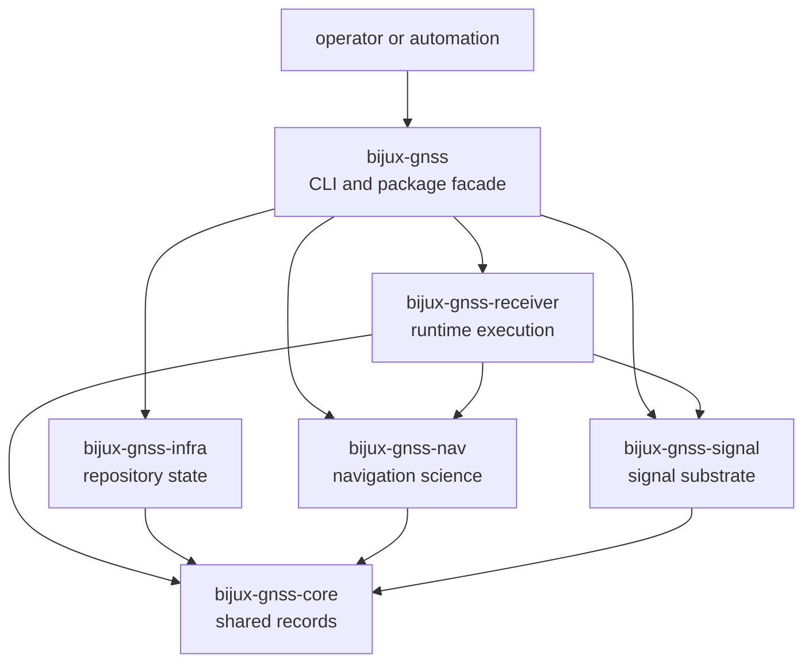

# Dependency Direction

`bijux-gnss` is the operator boundary. It depends downward so users and
automation can enter the GNSS stack through one command surface while lower
crates keep ownership of science, runtime, persistence, and shared contracts.

## Stack Direction

No lower crate depends upward on the command crate. If a lower owner needs a
capability that only exists in `bijux-gnss`, the capability belongs in the lower
owner or in a shared crate, not in the CLI.

## Downward Edges

| dependency | command crate uses it for | command crate does not own |
| --- | --- | --- |
| `bijux-gnss-core` | shared config, records, units, diagnostics, artifact shapes | shared semantic changes |
| `bijux-gnss-signal` | signal-facing command workflows and identifiers | spreading codes, DSP, signal model facts |
| `bijux-gnss-receiver` | acquisition, tracking, runtime runs, in-memory receiver artifacts | stage internals, ports, runtime state |
| `bijux-gnss-infra` | dataset, run layout, artifact inspection, provenance, persisted evidence | repository-state meaning |
| `bijux-gnss-nav` | navigation decode, product, correction, and validation flows | orbit, correction, estimator, PPP, RTK science |

## Facade Discipline

- Re-export only stable package-level entrypoints that make command-adjacent use
  clearer.
- Do not turn the facade into a mixed API that hides the lower owner.
- Route report details to the owner that proves the behavior.
- Keep command handlers responsible for orchestration, validation, and
  presentation, not lower-crate implementation.

## First Proof Check

Inspect `crates/bijux-gnss/docs/BOUNDARY.md`,
`crates/bijux-gnss/docs/COMMANDS.md`,
`crates/bijux-gnss/docs/WORKFLOWS.md`,
`crates/bijux-gnss/src/cli/`, and `crates/bijux-gnss/src/lib.rs`.
