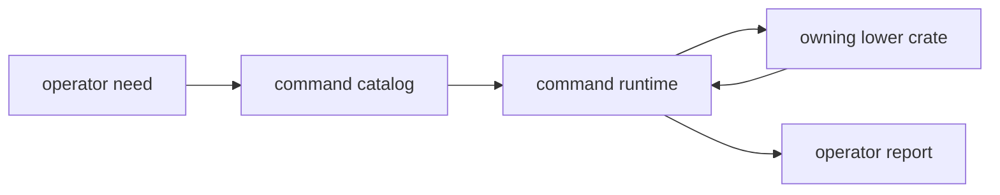

# Extensibility Model

Extending `bijux-gnss` should mean adding or deepening a real command workflow,
not bolting convenience glue onto the top of the stack.

## Extension Flow

## Legitimate Extension Paths

- add a new operator workflow under `commands/`
- deepen the command catalog with a durable new argument or command family
- add a new reporting surface for a real command-owned output need
- add a new command/runtime support adapter that remains clearly command-owned

## Illegitimate Extension Paths

- adding lower-owner algorithms directly to command modules
- embedding repository layout policy into reporting or support helpers
- widening the facade only to save one caller an import statement

## Decision Table

| proposed change | belongs here when | route elsewhere when |
| --- | --- | --- |
| new command | it represents a stable operator workflow | it only exposes one lower-crate helper |
| new flag | it changes command behavior or report shape | it configures lower science without command semantics |
| new facade export | multiple downstream users need a stable import path | it hides the true owner from readers |
| new support helper | it coordinates command input, output, or report setup | it owns science, runtime state, or repository layout |

## Review Checks

- Can the new surface be named by a durable command responsibility?
- Does the command hand work to the lower crate that owns the behavior?
- Can an operator understand the output without reading receiver, nav, or infra
  internals?
