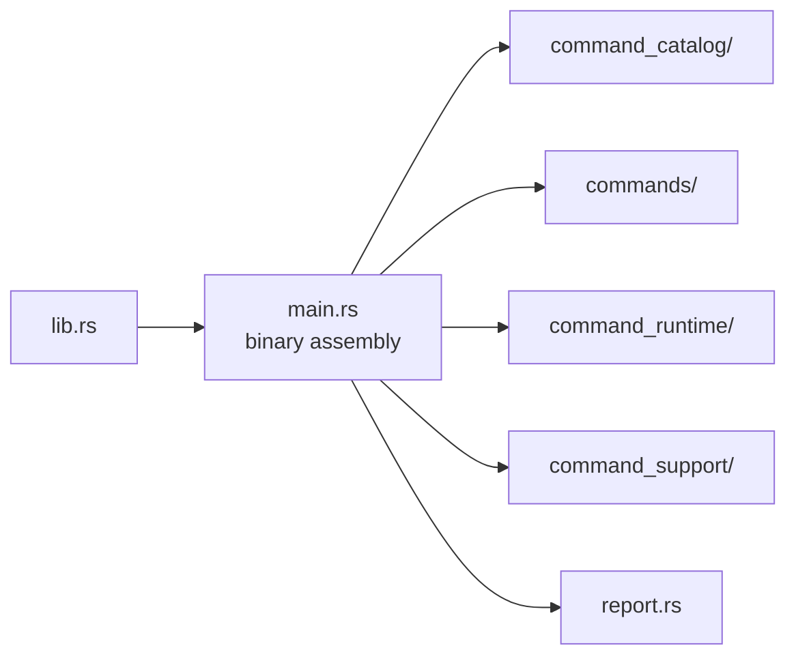

# Architecture

Open this section when the question is structural: where command parsing,
workflow dispatch, runtime support, reporting, and facade ownership live in
code, and how the crate stays thin without becoming shapeless.

## Structural Shape

## Read These First

- open [Module Map](module-map.md) first when you need the fastest route from
  a command concern to the owning code area
- open [Dependency Direction](dependency-direction.md) when the question is
  whether the command crate is aggregating lower-level behavior honestly
- open [Integration Seams](integration-seams.md) when a change seems to pull
  runtime, repository, or science policy inward

## Pages In This Section

- [Module Map](module-map.md)
- [Dependency Direction](dependency-direction.md)
- [Execution Model](execution-model.md)
- [State And Persistence](state-and-persistence.md)
- [Integration Seams](integration-seams.md)
- [Error Model](error-model.md)
- [Extensibility Model](extensibility-model.md)
- [Code Navigation](code-navigation.md)
- [Architecture Risks](architecture-risks.md)

## First Proof Check

- `crates/bijux-gnss/src/main.rs`
- `crates/bijux-gnss/src/cli/`
- `crates/bijux-gnss/docs/ARCHITECTURE.md`

## Leave This Section When

- leave for [Foundation](../foundation/) when the real dispute is still about
  ownership rather than structure
- leave for [Interfaces](../interfaces/) when the structural question is
  already about public contract shape
- leave for [Quality](../quality/) when the structure is clear and the next
  question is proof sufficiency
