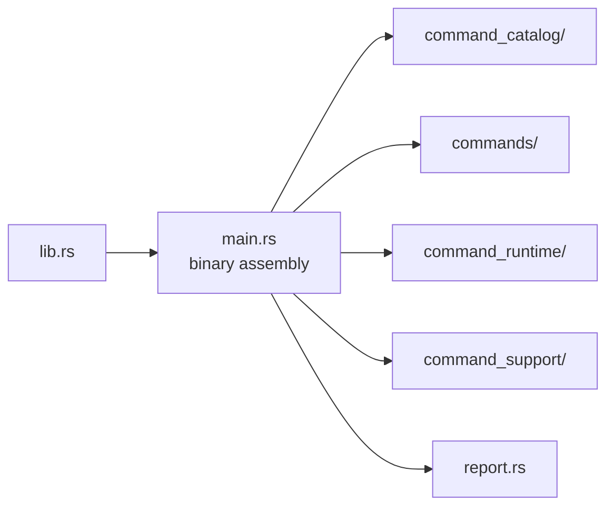

# Architecture

Open this section when the question is structural: where command parsing,
workflow dispatch, runtime support, reporting, and facade ownership live in
code, and how the crate stays thin without becoming shapeless.

## Structural Shape

## Read These First

- open [Foundation](../foundation/) first if the real dispute is still about
  ownership rather than structure
- stay in this section when the question is where a command-boundary family
  belongs in code and which dependency direction is legitimate

## First Proof Check

- `crates/bijux-gnss/src/main.rs`
- `crates/bijux-gnss/src/cli/`
- `crates/bijux-gnss/docs/ARCHITECTURE.md`
