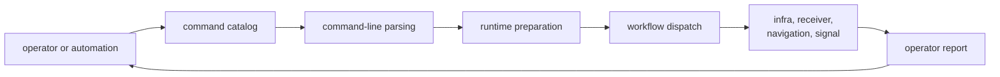

# Module Map

Enter `bijux-gnss` through the operator interaction you are changing. The
command crate is a composition boundary: it parses intent, prepares repository
and runtime context, dispatches a lower-owner workflow, and renders the result.

## Choose A Command Route

| question | owning subsystem | what belongs there |
| --- | --- | --- |
| Which command, subcommand, flag, or argument group is public? | [Command catalog](../../../crates/bijux-gnss/src/cli/command_catalog/) | stable vocabulary and typed argument shape |
| How are catalog types assembled into the binary parser? | [Command-line parser](../../../crates/bijux-gnss/src/cli/command_line.rs) | parser composition and top-level dispatch selection |
| How is the process environment prepared before execution? | [Command runtime](../../../crates/bijux-gnss/src/cli/command_runtime/) | runtime environment, dataset inspection, and acquisition or synthetic reporting support |
| Which top-level operator workflow runs? | [Command workflows](../../../crates/bijux-gnss/src/cli/commands/) | artifact, ingest, analyze, synthetic, pipeline, validation, and diagnostics dispatch |
| How does a workflow adapt lower-owner artifacts and inputs? | [Command support](../../../crates/bijux-gnss/src/cli/command_support/) | capture windows, artifact loading, receiver outputs, navigation outputs, and raw-IQ quality adapters |
| Which setup is shared by several execution paths? | [Execution support](../../../crates/bijux-gnss/src/cli/execution_support.rs) | common orchestration scaffolding that remains command-owned |
| How is a result rendered for an operator? | [Report renderer](../../../crates/bijux-gnss/src/cli/report.rs) | human and machine-facing command output |

## Binary And Library Boundaries

The [binary entrypoint](../../../crates/bijux-gnss/src/main.rs) assembles the
CLI. The [library facade](../../../crates/bijux-gnss/src/lib.rs) exposes a thin
package surface over lower-level GNSS APIs. Neither is a second home for
receiver, navigation, signal, or persistence behavior.

## Find A Workflow

The workflow directory separates durable operator concerns:

- [Artifact workflows](../../../crates/bijux-gnss/src/cli/commands/artifact.rs)
  explain and validate existing artifacts.
- [Ingest workflows](../../../crates/bijux-gnss/src/cli/commands/ingest.rs)
  convert declared inputs into repository-supported forms.
- [Pipeline execution](../../../crates/bijux-gnss/src/cli/commands/run_pipeline.rs)
  composes infra and receiver behavior.
- [Synthetic workflows](../../../crates/bijux-gnss/src/cli/commands/synthetic.rs)
  expose deterministic receiver scenarios.
- [Diagnostics workflows](../../../crates/bijux-gnss/src/cli/commands/diagnostics/)
  assemble operator evidence and gates.
- [Validation workflows](../../../crates/bijux-gnss/src/cli/commands/validate/)
  route schema and artifact checks.

## Boundary Tests

- A new flag belongs in the catalog, but its domain meaning belongs to the
  lower-owner configuration or contract.
- Dataset and run placement rules stay in infra.
- Receiver stage policy stays in receiver.
- Navigation and signal science stay in their packages.
- Command support may adapt outputs; it must not redefine them.

Use [Execution Model](execution-model.md) for control flow and
[Integration Seams](integration-seams.md) when a command change appears to move
ownership into the facade.
