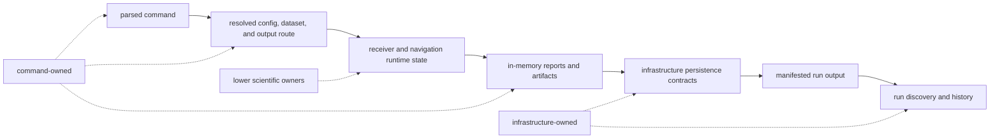
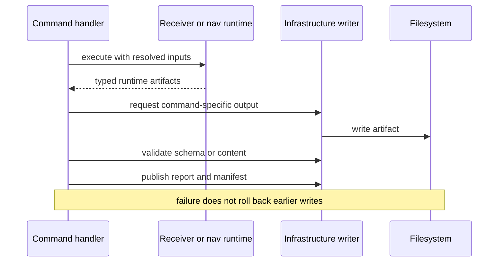

# State And Persistence

`bijux-gnss` assembles one invocation. It parses operator intent, resolves
inputs, creates lower-layer runtime configuration, renders results, and asks
infrastructure helpers to write artifacts. It does not own a long-lived
receiver session or define repository history.

## Lifetime And Ownership

| state | lifetime | owner | persistence meaning |
| --- | --- | --- | --- |
| parsed arguments and selected handler | one process invocation | command crate | none |
| resolved profile, dataset reference, seed, report format, and output route | one handler execution | command crate | may be summarized in a manifest, but the in-memory values are not a durable API |
| acquisition, tracking, observation, and navigation state | one lower-layer execution | receiver, signal, or navigation crate | command code may serialize outputs but does not own their scientific meaning |
| assembled command reports | until rendered or written | command crate | stable only where a documented schema or artifact contract says so |
| run layout, manifest, registry, and history | beyond the process | infrastructure crate | governed by infrastructure contracts, not by command-local helper names |

The command's [`common arguments`](../../../crates/bijux-gnss/src/cli/command_line.rs)
carry output and resume locations, but accepting a path does not transfer
persistence ownership to the parser. Runtime assembly is visible in the
[command runtime](../../../crates/bijux-gnss/src/cli/command_runtime.rs), while
receiver-owned state is documented in the
[receiver state guide](../../05-bijux-gnss-receiver/architecture/state-and-persistence.md).

## Output Is A Publication Sequence

Publication is composed from ordinary filesystem operations. The command does
not stage every output and atomically commit the directory. Consequently:

- file presence proves only that a write reached that point;
- a manifest should be treated as the completion record only for the contract
  that defines it;
- a failed command can leave a directory that is useful for diagnosis but not
  valid for comparison, history, or release evidence;
- rerunning into the same explicit output location requires care because the
  command boundary does not promise isolation from prior contents.

The concrete write path is implemented by
[command artifact support](../../../crates/bijux-gnss/src/cli/command_support/receiver_artifacts.rs)
and infrastructure APIs. Consult the
[persisted artifact contract](../../03-bijux-gnss-infra/interfaces/persisted-artifact-contracts.md)
before making durability or history claims.

## Resume Is An Input Contract

`--resume` identifies a prior run directory for commands that support replay or
continuation semantics. It is not an in-process checkpoint of the command
parser, and it does not imply that every lower-layer state object can be
reconstructed. A command must state which artifacts it reads, which settings
are inherited, and which work is recomputed.

When adding resume behavior, require:

- an explicit compatibility check for the prior artifact or manifest;
- provenance that identifies the source run;
- a clear distinction between reused evidence and newly computed evidence;
- refusal rather than best-effort guessing when required state is absent.

## Reader Rule

Use command documentation to understand invocation and publication. Use
receiver or navigation documentation to interpret scientific runtime state, and
use infrastructure documentation to decide whether persisted output is
complete, discoverable, or historically durable. The
[error model](error-model.md) describes how partial publication is reported.
