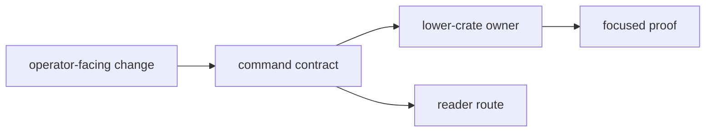

# Change Principles

Changes to `bijux-gnss` should preserve command-boundary legibility, not only
make the binary compile.

## Change Flow

## Principles

- keep command handlers focused on workflow composition rather than lower-level
  reimplementation
- group modules by operator workflow and durable responsibility instead of by
  incidental delivery history
- treat reporting and output shape as command-boundary contracts
- widen the Rust facade only when multiple consumers genuinely need a stable
  top-level package convenience
- keep command/runtime support helpers honest about being command-owned rather
  than lower-owner science

## Reader Impact

Before changing this crate, name the reader affected by the change:

| reader | impact to document |
| --- | --- |
| operator | command, argument, output, or artifact location changes |
| downstream Rust user | facade import changes and ownership routing |
| maintainer | command proof, validation command, or slow-lane behavior |
| lower-crate owner | delegated behavior now required by command workflow |

## Warning Signs

- a command helper is easier to describe by the lower crate it should have
  called
- the facade grows exports or helpers with one caller and no durable role
- command reporting starts embedding repository policy or runtime internals

## Review Checks

- Is this a command contract change or a lower-crate behavior change?
- Did docs move with public command meaning?
- Is the narrowest proof command named for the changed route?
