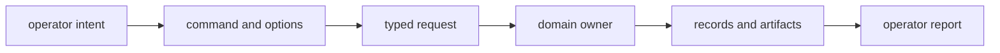
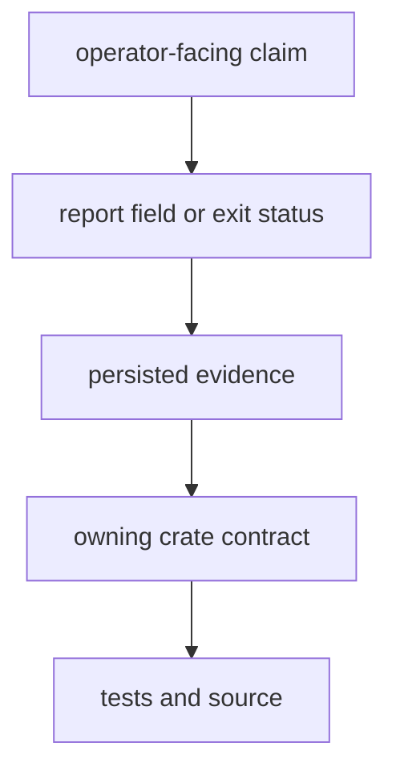

# Command Foundations

`bijux-gnss` is the operator boundary of the workspace. It turns command-line
intent into typed requests, delegates scientific and persistence work, and
returns reports and artifacts that identify what happened. It does not acquire
ownership of receiver algorithms, signal processing, navigation models, shared
records, or repository layout merely because it invokes them.

## Follow The Request

The command crate owns the first three transitions and the final presentation.
The lower crate owns the domain behavior and the meaning of the evidence it
produces. A trustworthy command preserves that distinction in its errors,
reports, and documentation.

## Start With Your Question

| question | read next |
| --- | --- |
| Which command matches an operator intent? | [Operator questions](operator-faq.md) |
| Which options and output fields are part of the interface? | [Command contracts](../interfaces/command-contracts.md) and [report contracts](../interfaces/reporting-contracts.md) |
| What sequence does a multi-stage command perform? | [Workflow contracts](../interfaces/workflow-contracts.md) |
| Is this behavior owned by the command crate at all? | [Ownership boundary](ownership-boundary.md) |
| What must the command crate refuse? | [Scope and non-goals](scope-and-non-goals.md) |
| Where does an implementation concern live? | [Architecture map](../architecture/) |
| What evidence supports an operator-facing claim? | [Quality model](../quality/) |

## What The Boundary Promises

- **Intent remains visible.** Option names and command families describe the
  operation a user requested, not an internal helper that happens to implement
  it.
- **Delegation remains typed.** Runtime, signal, navigation, and repository
  inputs cross explicit crate boundaries instead of being reinterpreted in
  command handlers.
- **Outputs remain attributable.** Reports identify the command and the
  resulting evidence; persisted layout and manifest semantics remain owned by
  the infrastructure crate.
- **Failure remains honest.** Invalid operator input, unsupported science, and
  internal faults must not collapse into an ambiguous success or a generic
  degraded result.

Read this chain from top to bottom before trusting a command result. A clean
table is presentation, not proof. A schema-valid artifact proves structure, not
scientific validity. The decisive claim belongs to the contract and evidence
that produced it.

## Command Context

Use the [package overview](package-overview.md) for the shortest role
description. The [repository fit](repository-fit.md) explains how the binary
relates to the six publishable GNSS libraries, while
[dependencies and adjacencies](dependencies-and-adjacencies.md) identifies the
handoff to each one. [Domain language](domain-language.md) defines the terms
used across command documentation, and [change principles](change-principles.md)
sets the review standard for extending the boundary.

For implementation-level confirmation, inspect the
[command parser](../../../crates/bijux-gnss/src/cli/command_line.rs),
[command catalog](../../../crates/bijux-gnss/src/cli/command_catalog/mod.rs),
[runtime dispatcher](../../../crates/bijux-gnss/src/cli/command_runtime.rs),
[command-family reference](../../../crates/bijux-gnss/docs/COMMANDS.md), and
[workflow reference](../../../crates/bijux-gnss/docs/WORKFLOWS.md).
