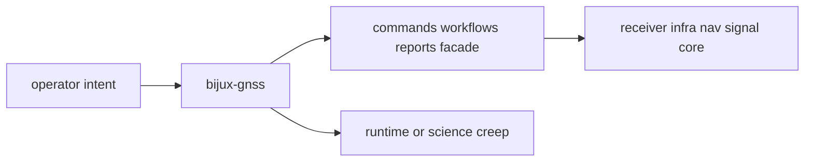

# Foundation

Open this section when the question is why `bijux-gnss` owns command-boundary
behavior before runtime, repository, signal, or navigation layers start
pulling the answer toward convenience.

## Boundary Model

The command boundary is only trustworthy when readers can see where command
vocabulary, workflow composition, and operator-facing reporting stop, and where
runtime, persistence, or science owners take over.

## Read These First

- open [Ownership Boundary](ownership-boundary.md) first when a feature feels
  adjacent to `receiver`, `infra`, `nav`, `signal`, or `core`
- open [Package Overview](package-overview.md) when you need the shortest
  durable description of the crate role
- open [Scope And Non-Goals](scope-and-non-goals.md) when the question is what
  the command crate should explicitly refuse

## The Mistake This Section Prevents

The most common mistake here is assuming that because a command invokes lower
layers, the command crate should own their behavior. This section keeps command
composition, runtime execution, repository persistence, and science boundaries
from collapsing into one owner.

## Pages In This Section

- [Package Overview](package-overview.md)
- [Scope And Non-Goals](scope-and-non-goals.md)
- [Ownership Boundary](ownership-boundary.md)
- [Repository Fit](repository-fit.md)
- [Domain Language](domain-language.md)
- [Dependencies And Adjacencies](dependencies-and-adjacencies.md)
- [Change Principles](change-principles.md)

## First Proof Check

- `crates/bijux-gnss/README.md`
- `crates/bijux-gnss/docs/BOUNDARY.md`
- `crates/bijux-gnss/src/main.rs`
- `crates/bijux-gnss/src/cli/command_catalog/`
- `crates/bijux-gnss/src/cli/commands/`

## Leave This Section When

- leave for [Interfaces](../interfaces/) when the dispute is already about a
  public command, report, or facade contract
- leave for [Architecture](../architecture/) when the ownership question is
  settled and the next question is where the code lives
- leave for [Quality](../quality/) when the boundary is clear and the question
  becomes whether the trust story is honest enough
