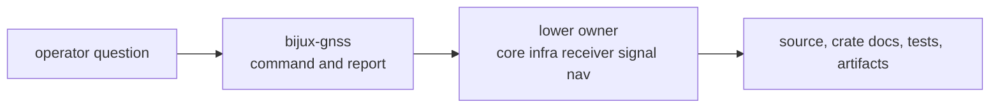

# Operator FAQ

Use this FAQ when an operator-facing question starts at `bijux gnss` but the
answer depends on a lower crate. The command crate owns the route and the
report; the lower crate owns the deeper proof.

## Routing Answers

| operator question | short answer | inspect next |
| --- | --- | --- |
| Which time system does a command assume? | The command must preserve explicit time context and hand shared time meaning to core. | [core foundation](../../02-bijux-gnss-core/foundation/) |
| Which reference frame is used? | Command output should name the frame instead of relying on context; shared coordinate meaning starts in core and navigation model detail starts in nav. | [core](../../02-bijux-gnss-core/), [nav](../../04-bijux-gnss-nav/) |
| Where are ionosphere and troposphere handled? | Correction science belongs to nav; command docs only route to the command that invokes it. | [correction contracts](../../04-bijux-gnss-nav/interfaces/correction-contracts.md) |
| What does deterministic mode mean? | The command requests deterministic execution; receiver and maintainer docs prove runtime ordering and regression discipline. | [receiver quality](../../05-bijux-gnss-receiver/quality/), [dev quality](../../07-bijux-gnss-dev/quality/) |
| Where do run artifacts live? | Command flags choose output intent; infra owns persisted run layout and repository evidence interpretation. | [infra persisted artifacts](../../03-bijux-gnss-infra/interfaces/persisted-artifact-contracts.md) |
| Why did a command report degraded acquisition or tracking? | The command renders the state; receiver owns stage evidence and diagnostic meaning at runtime. | [receiver diagnostics](../../05-bijux-gnss-receiver/interfaces/diagnostic-contracts.md) |

## Operator Route

## Reader Checks

- Does the question begin with command syntax, report shape, or workflow order?
- Does the decisive proof actually live in a lower owner?
- Is the lower owner named clearly enough that the reader can leave command
  docs immediately?
- Does the answer avoid restating science or persistence rules that belong
  outside the command crate?

## First Proof Check

Inspect `crates/bijux-gnss/docs/COMMANDS.md`,
`crates/bijux-gnss/docs/WORKFLOWS.md`,
`crates/bijux-gnss/src/cli/command_line.rs`, and the target owner named by the
question.
