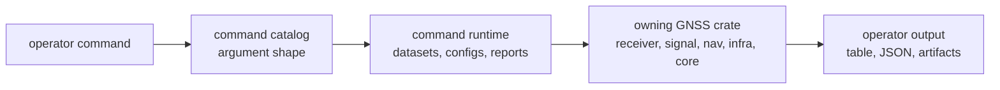

# Package Overview

`bijux-gnss` owns the operator-facing command boundary. If a human starts by
typing `bijux gnss ...`, this crate is the first owner even when the command
later calls receiver, signal, navigation, core, or infrastructure code.

The crate should stay thin, but not vague. It owns the shape of operator work:
argument names, command grouping, runtime setup, report rendering, and the
handoff from a command route to the crate that owns the deeper GNSS behavior.

## Command Handoff

## Owned Surfaces

| surface | owns | first proof |
| --- | --- | --- |
| binary entrypoint | `bijux` and the `gnss` command tree | `crates/bijux-gnss/src/main.rs`, `crates/bijux-gnss/src/cli/command_line.rs` |
| command catalog | stable subcommand and argument families | `crates/bijux-gnss/src/cli/command_catalog/` |
| command handlers | operator workflow routing and lower-crate calls | `crates/bijux-gnss/src/cli/commands/` |
| runtime setup | config loading, dataset resolution, synthetic reporting, acquisition reporting | `crates/bijux-gnss/src/cli/command_runtime.rs`, `crates/bijux-gnss/src/cli/command_runtime/` |
| command support | artifact loading, capture windows, raw-IQ quality, navigation output adapters | `crates/bijux-gnss/src/cli/command_support/` |
| operator reports | table and JSON output shape | `crates/bijux-gnss/src/cli/report.rs` |
| Rust facade | convenience re-exports over lower crates | `crates/bijux-gnss/src/lib.rs` |

## Reader Rules

- Start here for command names, arguments, report shape, and operator workflow
  composition.
- Leave for `bijux-gnss-receiver` when the question is stage behavior,
  runtime artifacts, acquisition, tracking, observations, or receiver-side
  validation.
- Leave for `bijux-gnss-infra` when the question is dataset registry meaning,
  sidecar metadata, run layout, overrides, or persisted provenance.
- Leave for `bijux-gnss-nav` when the question is ephemeris decoding, precise
  products, corrections, PVT, PPP, RTK, or navigation-time behavior.
- Leave for `bijux-gnss-signal` when the command exposes spreading codes,
  signal identity, sample contracts, raw-IQ interpretation, or DSP primitives.
- Leave for `bijux-gnss-core` when the disagreement is shared record meaning:
  IDs, units, time, observations, navigation solutions, diagnostics, or
  artifact envelopes.

## Boundary Tests

A command change belongs in this crate when it changes how an operator asks for
work or reads the result. It does not belong here when it changes the science
or persistence semantics behind that route.

| change | owner |
| --- | --- |
| rename or add a CLI argument | `bijux-gnss` |
| change how a dataset id resolves | `bijux-gnss-infra` |
| change acquisition ranking, tracking state, or observation construction | `bijux-gnss-receiver` |
| change code generation or DSP behavior | `bijux-gnss-signal` |
| change orbit, correction, PVT, PPP, or RTK logic | `bijux-gnss-nav` |
| change serialized observation or diagnostic meaning shared across crates | `bijux-gnss-core` |

## First Proof Check

Inspect `crates/bijux-gnss/README.md`, `crates/bijux-gnss/docs/COMMANDS.md`,
`crates/bijux-gnss/docs/PUBLIC_API.md`, `crates/bijux-gnss/src/cli/`, and the
integration tests named in the crate README. A package overview is stale if it
cannot point from an operator route to the exact lower owner that proves the
route.
