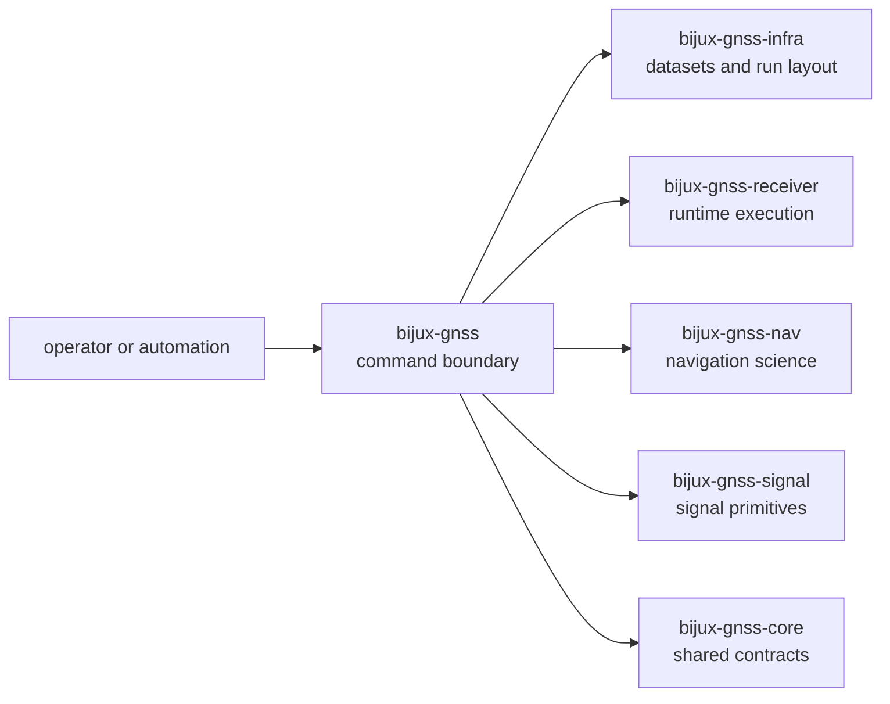

# bijux-gnss

`bijux-gnss` owns the operator-facing command boundary for `bijux-telecom`.
This crate is intentionally thin. Its job is not to absorb signal science,
navigation estimators, or receiver internals. Its job is to expose a stable
entrypoint over those lower-level owners and keep top-level workflows honest.

That thinness is a feature, not a weakness. The command crate is where a user
feels the product, but it should not quietly become the owner of the science
it invokes.

## Why This Package Exists

- the repository needs one installable public entrypoint rather than exposing
  each subsystem as an operator command surface
- command names, flags, reports, and top-level workflow selection should stay
  coherent even while lower-level crates evolve internally
- operators need one thin facade that can compose datasets, receiver runs,
  validation workflows, and artifact reporting without transferring ownership
  of those deeper concerns

## What It Owns

- the `bijux` binary and its stable command vocabulary
- argument parsing and command-runtime setup
- top-level workflow wiring across lower-level GNSS crates
- operator-facing reporting and package-level convenience re-exports

## What It Refuses

- reusable GNSS meaning that belongs in `bijux-gnss-core`
- repository persistence and dataset registry mechanics that belong in
  `bijux-gnss-infra`
- receiver pipeline execution policy that belongs in `bijux-gnss-receiver`
- navigation-domain algorithms that belong in `bijux-gnss-nav`
- signal catalogs, code families, or DSP primitives that belong in
  `bijux-gnss-signal`

## Strongest Proof Surfaces

- crate README:
  [`crates/bijux-gnss/README.md`](../../crates/bijux-gnss/README.md)
- crate architecture docs:
  [`crates/bijux-gnss/docs/ARCHITECTURE.md`](../../crates/bijux-gnss/docs/ARCHITECTURE.md)
- command boundary docs:
  [`crates/bijux-gnss/docs/COMMANDS.md`](../../crates/bijux-gnss/docs/COMMANDS.md)
- execution and workflow docs:
  [`crates/bijux-gnss/docs/EXECUTION.md`](../../crates/bijux-gnss/docs/EXECUTION.md),
  [`crates/bijux-gnss/docs/WORKFLOWS.md`](../../crates/bijux-gnss/docs/WORKFLOWS.md)
- source entrypoints:
  [`crates/bijux-gnss/src/main.rs`](../../crates/bijux-gnss/src/main.rs),
  [`crates/bijux-gnss/src/cli`](../../crates/bijux-gnss/src/cli)
- command-facing regression surfaces:
  [`crates/bijux-gnss/tests`](../../crates/bijux-gnss/tests)

## Support Crates That Matter Here

- `bijux-gnss-policies` guards the repository structure around the public
  command crate; inspect it when a CLI change also changes workspace boundary
  rules or public-surface guardrails.
- `bijux-gnss-testkit` supplies deterministic shared truth for
  command-facing integration flows; inspect it when a workflow claim depends on
  synthetic truth, checked-in fixtures, or independent reference behavior.

## Sections In This Handbook

- [Foundation](foundation/) for role, scope, ownership, repository fit, and
  command-boundary vocabulary
- [Architecture](architecture/) for CLI composition, runtime setup, support
  helpers, reporting, and dependency direction
- [Interfaces](interfaces/) for binary, command, reporting, facade, and
  compatibility contracts
- [Operations](operations/) for safe change sequence, verification, fixture
  care, and review scope
- [Quality](quality/) for invariants, proof strategy, limitations, risk, and
  change validation
- [This Package Does Not Own](this-package-does-not-own.md) for the explicit
  refusal ledger

## Start Here When

- the question is about command names, flags, or output shape
- the question starts from a repository command example in the root README
- the reader needs to know which lower-level crate a command eventually hands
  off to
- the issue is whether a top-level workflow is wired correctly across crates

## Leave This Handbook When

- the question becomes about dataset resolution or run persistence:
  [03-bijux-gnss-infra](../03-bijux-gnss-infra/)
- the question becomes about receiver stage execution or validation artifacts:
  [05-bijux-gnss-receiver](../05-bijux-gnss-receiver/)
- the question becomes about navigation models or orbit products:
  [04-bijux-gnss-nav](../04-bijux-gnss-nav/)
- the question becomes about signal codes or DSP primitives:
  [06-bijux-gnss-signal](../06-bijux-gnss-signal/)
- the question becomes about shared identifiers, time systems, or artifact
  schema contracts:
  [02-bijux-gnss-core](../02-bijux-gnss-core/)

## Reader Questions This Package Can Answer

- which commands the repository intentionally presents to operators
- how command-line parsing is separated from runtime setup and reporting
- where top-level workflow composition ends and a deeper owner begins
- why the public facade must remain thin even when it touches many crates

## First Proof Check

- `crates/bijux-gnss/src/main.rs`
- `crates/bijux-gnss/src/cli/command_line.rs`
- `crates/bijux-gnss/src/cli/command_runtime.rs`
- `crates/bijux-gnss/src/cli/report.rs`
- `crates/bijux-gnss/docs/COMMANDS.md`
- `crates/bijux-gnss/docs/WORKFLOWS.md`

## Design Pressure

If `bijux-gnss` starts carrying receiver internals, repository persistence, or
reimplemented signal and navigation science because those surfaces are needed
"near the command," the CLI boundary becomes a catch-all instead of a durable
owner.
