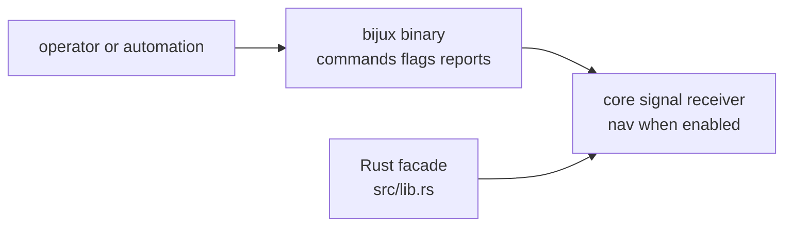

# API Surface

`bijux-gnss` has two public surfaces, and they serve different readers. The
`bijux` binary is the operator contract. The Rust facade in `src/lib.rs` is a
small package convenience layer over lower crates.

## Public Surface Map

## Surface Responsibilities

| surface | reader promise | should not own |
| --- | --- | --- |
| `bijux` binary | command families, flags, workflow selection, exit behavior, and operator reports | lower-crate science or data-model meaning |
| `src/lib.rs` facade | one-crate Rust access to the main GNSS stack | bespoke helpers or a parallel API namespace |
| CLI support modules | parsing, loading, routing, and report assembly needed by commands | stable contracts that belong in core, signal, receiver, nav, or infra |
| lower crates | scientific, receiver, signal, navigation, and infrastructure meaning | command naming or operator presentation |

## Admission Rules

- Add binary surface only when an operator can invoke it intentionally and the
  output can be documented as a durable workflow.
- Add facade surface only when one-crate Rust discovery is useful and ownership
  still stays in the lower crate.
- Keep command-only parsing and presentation helpers out of the facade.
- Keep lower-owner scientific exports in their owning crates unless the facade
  simply re-exports an existing public surface.
- Review command changes as user-facing compatibility changes, not as internal
  refactors.

## First Proof Check

Inspect `crates/bijux-gnss/src/main.rs`, `crates/bijux-gnss/src/lib.rs`,
`crates/bijux-gnss/src/cli/`, `crates/bijux-gnss/API.md`,
`crates/bijux-gnss/docs/PUBLIC_API.md`, and
`crates/bijux-gnss/docs/COMMANDS.md` before changing this public surface.
