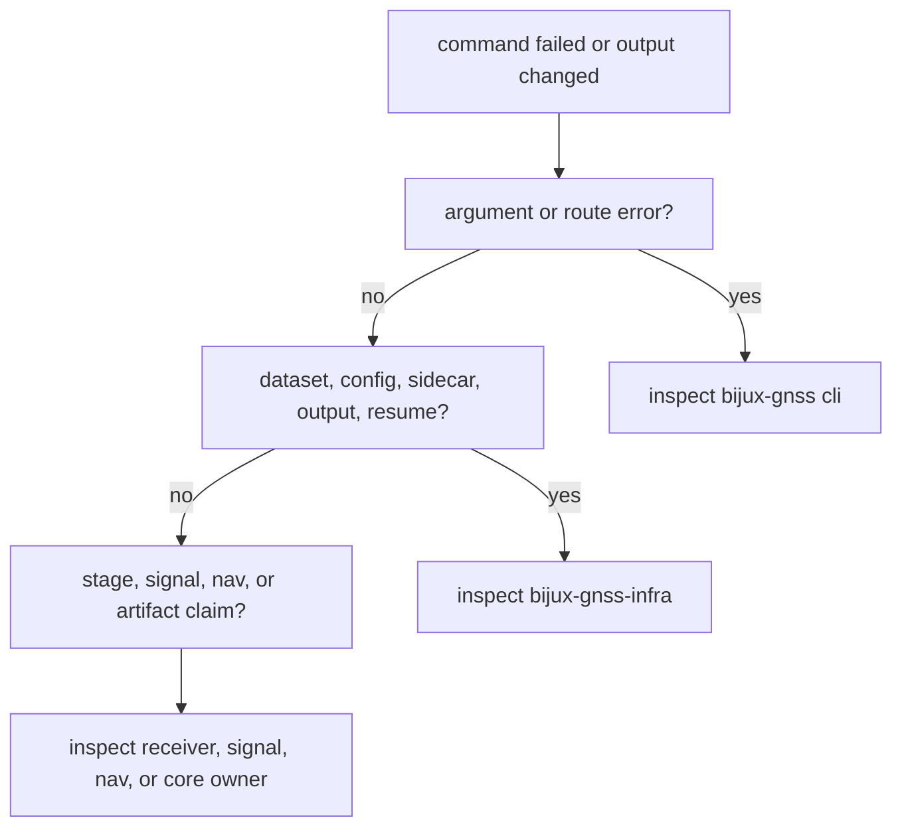

# CLI Reference

The durable command entrypoint is `bijux gnss`. This page is a route map, not a
copy of `--help`: use live help for exact flag spelling, then use this page to
understand which owner proves each workflow.

## Command Families

| family | examples in the command tree | primary owner after argument parsing |
| --- | --- | --- |
| signal inspection | `ca-code` | `bijux-gnss-signal` for code facts and correlation behavior |
| acquisition and tracking | `acquire`, `track` | `bijux-gnss-receiver` for stage execution, ranking, lock state, and diagnostics |
| receiver runs | `run`, `experiment` | `bijux-gnss-receiver` for runtime behavior, `bijux-gnss-infra` for run layout and overrides |
| raw-IQ and dataset work | `inspect`, sidecar validation, synthetic IQ export and validation | `bijux-gnss-infra` for metadata and persisted bundle meaning, `bijux-gnss-receiver` for synthetic runtime proof |
| navigation | `nav decode`, `pvt`, `rtk`, synthetic navigation validation | `bijux-gnss-nav` for navigation science, `bijux-gnss-core` for shared records |
| artifacts and diagnostics | `artifact validate`, `artifact explain`, diagnostics routes, run comparison | `bijux-gnss-core` for artifact meaning, `bijux-gnss-infra` for persisted run evidence |
| configuration | config validation, schema, defaults, upgrade | `bijux-gnss-receiver` for runtime config meaning, `bijux-gnss-infra` when repository override or profile mechanics are involved |

## What The Command Layer Promises

- command families stay organized around operator intent, not internal module
  layout
- common flags such as config, dataset, output directory, report format, seed,
  sidecar, and resume are interpreted consistently before lower-crate handoff
- table and JSON reports describe the command result without hiding which
  lower owner produced the evidence
- workflow handlers avoid duplicating lower-crate science or repository
  persistence rules

## What It Does Not Promise

- every internal subcommand path is a permanent API commitment
- command docs are the final source for receiver, signal, navigation, core, or
  infrastructure semantics
- a passing command alone proves the scientific claim behind the command
- command output fields can change shared artifact meaning without a core or
  infrastructure contract update

## Reading A Command Failure

## First Proof Check

Run or inspect live `bijux gnss --help` for the current command surface. Then
inspect:

- `crates/bijux-gnss/src/cli/command_line.rs`
- `crates/bijux-gnss/src/cli/command_catalog/`
- `crates/bijux-gnss/src/cli/commands/`
- `crates/bijux-gnss/src/cli/command_runtime/`
- `crates/bijux-gnss/docs/PUBLIC_API.md`
- `crates/bijux-gnss/docs/COMMANDS.md`

If this reference says a command belongs to one owner and the handler calls a
different owner for the decisive behavior, fix the route rather than padding
the command docs with generic language.
