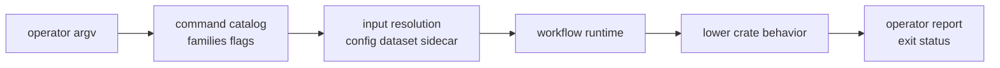

# Command Contracts

Command contracts define what operators and automation can rely on when they
invoke `bijux gnss ...`. The CLI owns command names, arguments, workflow
selection, and report shape. It does not own the scientific meaning produced by
core, signal, receiver, nav, or infra.

## Command Route

## Owned Command Families

| family | operator question answered | lower owner called |
| --- | --- | --- |
| acquisition and tracking | can this capture produce receiver evidence? | signal, receiver, infra |
| capture inspection and ingest | what does this raw input or dataset mean? | signal, infra |
| run pipeline | how is a configured run executed and persisted? | receiver, infra |
| artifacts | can this persisted output be explained, validated, or converted? | core, receiver, nav, infra |
| synthetic outputs | can deterministic generated data be created and checked? | signal, receiver, infra |
| navigation and RINEX | can navigation products be decoded, exported, or solved? | nav, core, infra |
| configuration and diagnostics | is the operator input valid and explainable? | core, infra, receiver |
| validation and analysis | do runs, references, and artifacts satisfy stated budgets? | receiver, nav, infra |

## Stability Rules

- Treat command names, flag meaning, report format selection, and exit behavior
  as public surface.
- Keep lower-crate behavior behind orchestration calls; do not redefine it in
  command support modules.
- Add a command only when it has a durable operator job, not because a helper is
  easy to expose.
- Keep report text honest about skipped inputs, degraded evidence, unsupported
  formats, and validation failures.
- Update command docs and CLI tests together when a workflow route changes.

## First Proof Check

Start with the command [catalog source](../../../crates/bijux-gnss/src/cli/command_catalog/),
[command-line parser](../../../crates/bijux-gnss/src/cli/command_line.rs),
[handler source](../../../crates/bijux-gnss/src/cli/commands/),
[runtime source](../../../crates/bijux-gnss/src/cli/command_runtime/), and
[support source](../../../crates/bijux-gnss/src/cli/command_support/). Then
confirm operator-facing promises against the [command guide](../../../crates/bijux-gnss/docs/COMMANDS.md).
