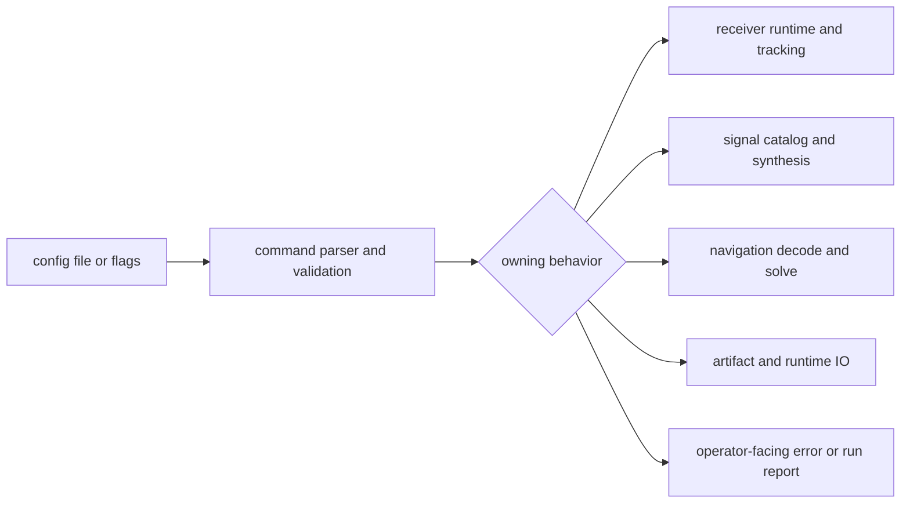

# Configuration Contracts

`bijux-gnss` owns the operator-facing configuration surface even when lower
crates own specific validation or execution semantics.

## Contract Shape

The command crate owns the stable shape that an operator edits: flag names,
configuration keys, defaults exposed by commands, validation diagnostics, and
report wording. It must keep enough context in those diagnostics for the reader
to know which lower crate owns the rejected behavior.

## Configuration Areas

| operator setting | command responsibility | lower owner |
| --- | --- | --- |
| capture input, sample rate, IF, quantization | parse the request and present rejected capture metadata clearly | `bijux-gnss-receiver` for receiver interpretation; `bijux-gnss-infra` for artifact IO |
| acquisition search bounds and thresholds | expose the accepted range and pass the request without hidden policy changes | `bijux-gnss-receiver` and `bijux-gnss-signal` |
| tracking loop bandwidths, correlator spacing, and lock gates | validate the operator shape and preserve names in reports | `bijux-gnss-receiver` |
| signal identifiers, PRN ranges, and synthetic generation knobs | accept catalog names consistently and reject unsupported combinations early | `bijux-gnss-signal` |
| navigation decode, solve, weighting, and export controls | expose workflow selection and operator-visible validation | `bijux-gnss-nav` |

## Boundary Rule

The command crate owns how configuration is presented and validated for the
operator. Lower crates still own the actual runtime, infrastructure, signal, or
navigation behavior behind those settings.

Do not copy lower-crate rules into command docs as if the command layer is the
source of truth. Link the operator surface here, then cite the lower contract
that proves the behavior.

## Proof Surfaces

- `crates/bijux-gnss/docs/VALIDATION.md` for accepted and rejected
  configuration routes.
- `crates/bijux-gnss/docs/COMMANDS.md` for public command names and flags.
- `crates/bijux-gnss/tests/integration_validate_config.rs` for command-level
  validation behavior.
- The lower crate's interface page when a setting changes scientific,
  artifact, runtime, or signal meaning.

## Reader Check

After editing this surface, a maintainer should be able to answer two questions
without reading the whole repository: what will the operator type, and which
crate owns the resulting behavior?
