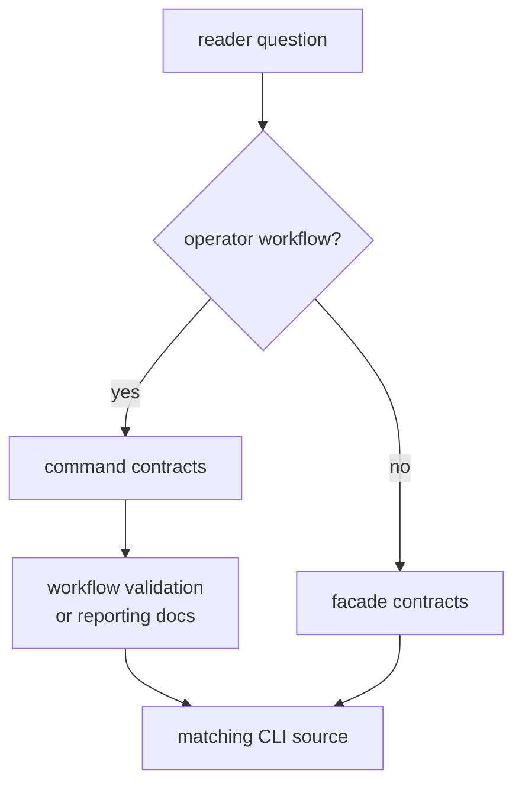

# Entrypoints and Examples

Use this page to choose the public starting point before opening source files.
The command crate has two reader paths: operator workflows through the binary,
and Rust discovery through the facade.

## Reader Route



## Starting Points

| reader question | start here | then inspect |
| --- | --- | --- |
| Which command owns this workflow? | command contracts | workflow contracts and `src/cli/commands/` |
| Why does this validation output look this way? | validation contracts | reporting contracts and validation command support |
| Where should a new CLI flag live? | command contracts | command catalog and common argument structs |
| Is this a Rust facade export? | facade contracts | `src/lib.rs` and the owning lower crate |
| Why is a dataset or run directory interpreted this way? | workflow contracts | infra docs and command runtime support |

## Minimal Examples

Operator entrypoint:

```sh
bijux gnss inspect --dataset recorded-clean --report json
```

Rust facade entrypoint:

```rust
use bijux_gnss::{core, receiver, signal};

let _ = (core::api::GPS_L1_CA_CARRIER_HZ, signal::api::CA_CODE_PERIOD_CHIPS);
```

These examples are intentionally small. Full workflows belong in command docs
or lower-crate docs; this page exists to route the reader to the correct owner.

## First Proof Check

Inspect `crates/bijux-gnss/docs/COMMANDS.md`,
`crates/bijux-gnss/docs/WORKFLOWS.md`,
`crates/bijux-gnss/docs/VALIDATION.md`,
`crates/bijux-gnss/docs/REPORTING.md`, `crates/bijux-gnss/src/lib.rs`, and the
matching CLI source under `crates/bijux-gnss/src/cli/`.
