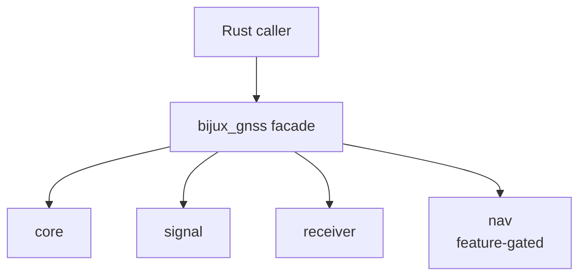

# Facade Contracts

The Rust facade is intentionally smaller than the binary surface. It exists so
Rust consumers can discover the main GNSS stack through one crate without
turning the command crate into another owner of core, signal, receiver, or nav
semantics.

## Facade Shape

## Facade Commitments

| facade item | commitment | owner of behavior |
| --- | --- | --- |
| `core` re-export | shared records, units, diagnostics, artifacts, and time contracts remain reachable | `bijux-gnss-core` |
| `signal` re-export | signal definitions, code generation, sample contracts, and DSP helpers remain reachable | `bijux-gnss-signal` |
| `receiver` re-export | receiver stages, runtime helpers, ports, artifacts, and simulation contracts remain reachable | `bijux-gnss-receiver` |
| `nav` re-export | navigation APIs are available only when the feature is enabled | `bijux-gnss-nav` |

## Rejection Rules

- Do not add command-only helper functions to the facade.
- Do not re-export private lower-crate modules to avoid fixing a real public API
  gap in the owning crate.
- Do not use the facade to hide feature-gated navigation behavior.
- Do not add convenience aliases that make readers guess which lower crate owns
  the meaning.
- Do improve the owning crate first when an export has durable scientific or
  infrastructure meaning.

## First Proof Check

Inspect `crates/bijux-gnss/src/lib.rs`,
`crates/bijux-gnss/docs/FACADE.md`,
`crates/bijux-gnss/docs/PUBLIC_API.md`, and the `api.rs` files in the lower
crates before changing facade exports.
