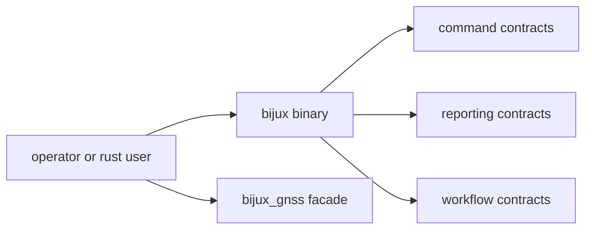

# Interfaces

Open this section when the question is contractual: which command, reporting,
workflow, and facade surfaces are safe for an operator or downstream Rust user
to rely on.

## Contract Surface

## Read These First

- open [API Surface](api-surface.md) first when the question is whether a
  binary or facade surface belongs in the durable command boundary
- open [Command Contracts](command-contracts.md) when the issue starts from
  commands, flags, or argument shape
- open [Facade Contracts](facade-contracts.md) when the issue is about Rust
  package exports rather than the binary

## Pages In This Section

- [API Surface](api-surface.md)
- [Public Imports](public-imports.md)
- [Command Contracts](command-contracts.md)
- [Workflow Contracts](workflow-contracts.md)
- [Reporting Contracts](reporting-contracts.md)
- [Validation Contracts](validation-contracts.md)
- [Facade Contracts](facade-contracts.md)
- [Entrypoints And Examples](entrypoints-and-examples.md)
- [Compatibility Commitments](compatibility-commitments.md)

## First Proof Check

- `crates/bijux-gnss/src/main.rs`
- `crates/bijux-gnss/API.md`
- `crates/bijux-gnss/docs/PUBLIC_API.md`

## Leave This Section When

- leave for [Foundation](../foundation/) when the question is whether a public
  surface belongs in the command crate at all
- leave for [Architecture](../architecture/) when the contract issue reveals
  structural drift underneath it
- leave for [Operations](../operations/) or [Quality](../quality/) when the
  public shape is clear and the question becomes safe change or proof
