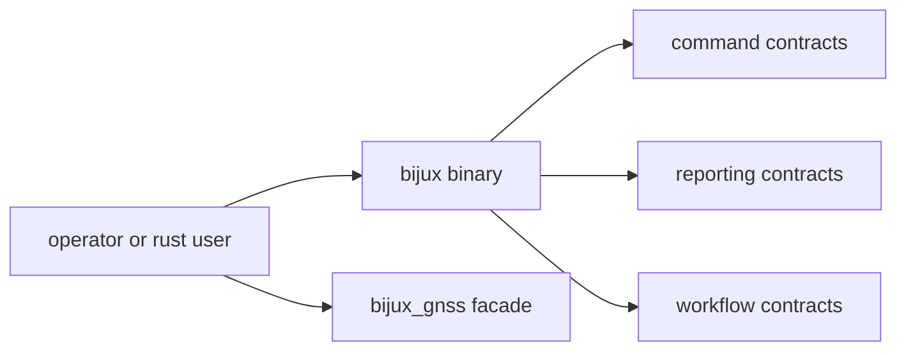

# Interfaces

Open this section when the question is contractual: which command, reporting,
workflow, and facade surfaces are safe for an operator or downstream Rust user
to rely on.

## Contract Surface

## Read These First

- open [Foundation](../foundation/) first if the question is whether a public
  surface belongs in the command crate at all
- stay in this section when the question is whether a command, flag, report, or
  facade export deserves a durable public promise

## First Proof Check

- `crates/bijux-gnss/src/main.rs`
- `crates/bijux-gnss/API.md`
- `crates/bijux-gnss/docs/PUBLIC_API.md`
