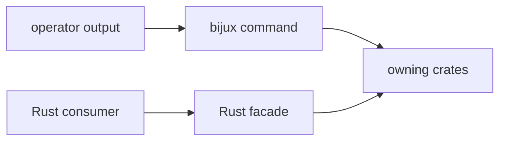

# Public Imports

`bijux-gnss` publishes two different public surfaces: the operator command and
the thin Rust facade. Treat them separately. A change can be safe for the
binary and still be wrong for the facade, or useful for the facade and still
too detailed for an operator-facing command.

## Binary Surface

- command names and flags exposed through `bijux`
- validation exits and operator-readable failure messages
- report fields that scripts or humans rely on
- workflow routing into infra, receiver, signal, navigation, and core owners

## Facade Surface

- lower-crate modules re-exported for package convenience
- feature-gated access to navigation surfaces when enabled
- stable imports that let downstream Rust users depend on one package without
  pretending the command crate owns the deeper behavior

Facade exports are package-level convenience routes. They are not ownership
transfers into the command crate.

## Reader Decision Table

| question | public surface | proof to inspect |
| --- | --- | --- |
| Does an operator invoke it? | binary | [Command contracts](command-contracts.md), [CLI reference](cli-reference.md) |
| Does a script parse it? | binary | [Reporting contracts](reporting-contracts.md), [Compatibility commitments](compatibility-commitments.md) |
| Does Rust code import it from this package? | facade | [Facade contracts](facade-contracts.md), [API surface](api-surface.md) |
| Does the implementation live below this crate? | facade route only | owning lower-crate README and API docs |

## Review Rule

Do not add new domain behavior to this crate because it makes an import path
shorter. If the value is signal science, navigation science, receiver runtime,
repository persistence, or shared vocabulary, keep the owner below this crate
and expose only a clear route when the package facade genuinely needs one.
