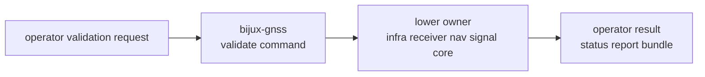

# Validation Contracts

Command validation contracts define how an operator invokes validation and how
the result is presented. The command crate assembles lower-owner checks; it does
not become the owner of receiver validation, navigation science, signal models,
or repository artifact semantics.

## Validation Route

## Owned Validation Surfaces

| command-owned surface | reader promise | lower proof owner |
| --- | --- | --- |
| command names and flags | validation is discoverable from the binary surface | [command guide](../../../crates/bijux-gnss/docs/COMMANDS.md) |
| argument interpretation | inputs are routed to the right lower owner | [validation guide](../../../crates/bijux-gnss/docs/VALIDATION.md) |
| evidence-bundle publication | the command packages evidence without changing meaning | infra and receiver docs |
| config validation routing | schema and user-facing failures are reported coherently | core config contracts and command tests |
| synthetic validation routing | generated IQ or navigation outputs are checked through owning crates | receiver, signal, and nav docs |

## Boundary Decisions

- Capture metadata and persisted artifacts route to infra.
- Runtime validation and reference alignment route to receiver.
- Signal assumptions and raw sample semantics route to signal.
- Navigation products, corrections, and science-policy results route to nav.
- Shared schema, diagnostics, and artifact record meaning route to core.

## First Proof Check

Inspect validate-command source, the [validation guide](../../../crates/bijux-gnss/docs/VALIDATION.md),
and focused command tests for config validation, capture validation, synthetic
IQ validation, and synthetic navigation validation.
