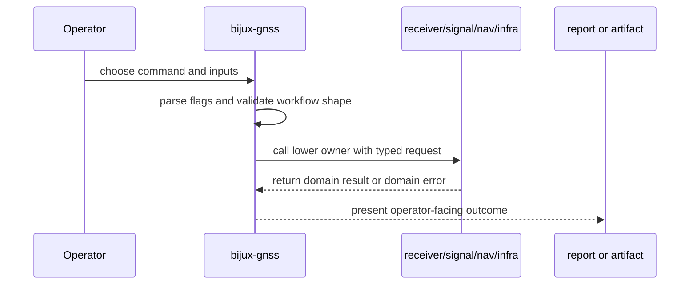

# Workflow Contracts

Workflow contracts define how the command crate assembles lower-level crates
into operator-facing flows.

## Workflow Contract

A workflow contract is the promise that the command crate will preserve the
operator route from input to evidence. It does not make the command crate the
owner of acquisition math, tracking loops, signal generation, navigation
science, artifact layout, or runtime IO.

## Owned Workflow Families

| workflow family | command-owned contract | lower-owner contract |
| --- | --- | --- |
| acquisition and capture inspection | command shape, user input, report fields | receiver acquisition and capture interpretation |
| run-pipeline execution | top-level workflow selection and result presentation | receiver stages, infra runtime, signal catalog, nav products |
| validation and explanation | accepted inputs, rejected inputs, diagnostics | artifact, signal, nav, and receiver contract truth |
| synthetic generation and export | command route and output naming | signal synthesis and infra persistence |
| navigation decode and RINEX-oriented flows | workflow entrypoint and operator report | nav decode, solve, and format rules |
| analysis and comparison | selected artifacts and comparison report | owner-specific metric semantics |

## Boundary Rule

These are orchestration contracts, not scientific ownership claims. The command
crate owns how workflows are selected and presented, not the deeper behavior of
receiver, infra, signal, or nav crates.

## Proof Routing

- Use `crates/bijux-gnss/docs/WORKFLOWS.md` to confirm the public workflow.
- Use `crates/bijux-gnss/docs/EXECUTION.md` when runtime setup or execution
  sequencing changes.
- Use `crates/bijux-gnss/src/cli/commands/` to find the command module that
  owns the route.
- Use lower-crate docs and tests when a workflow change modifies behavior after
  orchestration.

## Failure Modes

- A command report claims receiver, signal, nav, core, or infra behavior that
  is not proven in that owner.
- A validation workflow rejects input without naming the operator field and the
  lower contract involved.
- A workflow doc lists internal helper calls but never tells the operator what
  input creates what evidence.
