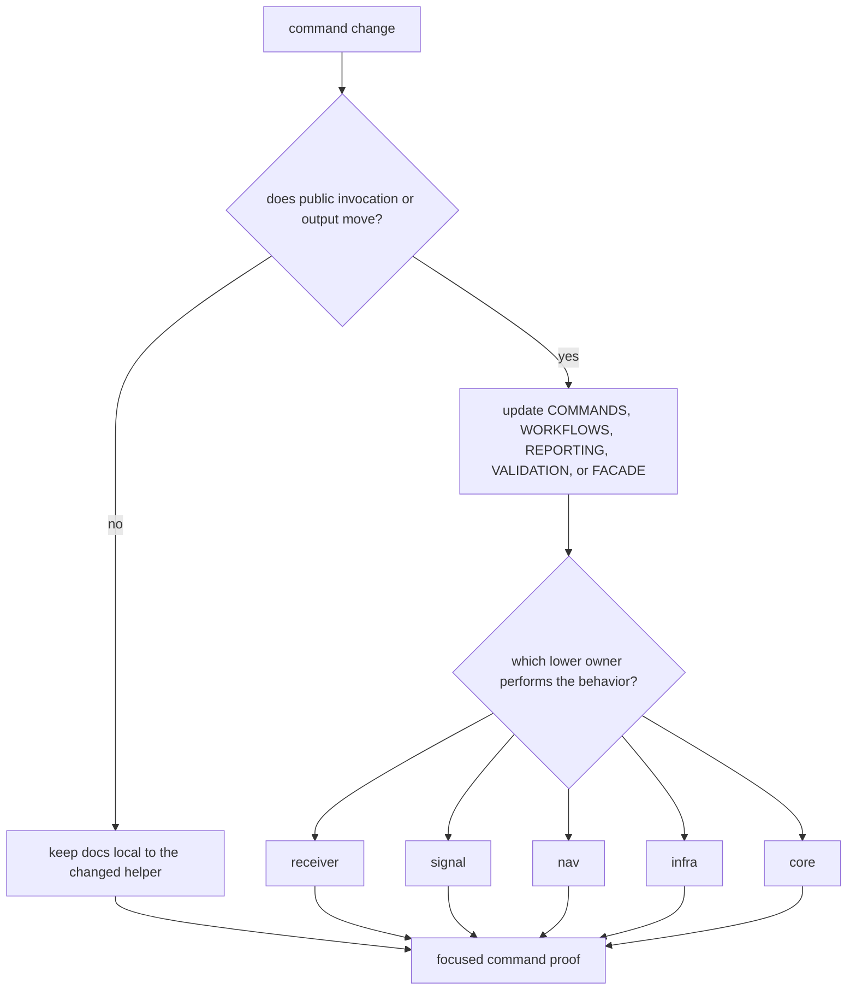

# Change Sequence

Use this sequence when a command change affects public invocation, workflow
selection, validation, reporting, facade exports, or the way lower crates are
composed. The command crate is the operator's front door; every change should
make that route clearer without taking ownership from receiver, signal, nav,
core, or infra.

## Decision Flow

## Recommended Sequence

1. Name the operator-facing workflow or facade surface.
2. Identify the lower crate that owns the behavior after command parsing.
3. Read the matching command docs before editing.
4. Change one coherent command route and tightly coupled docs or tests.
5. Run the narrowest command proof for the public route.
6. Add lower-owner proof only when the underlying behavior meaning moved.
7. Commit before widening to a separate command family.

## Why The Sequence Matters

This crate sits at the top of the stack, so one "small" command change can
quietly shift workflow meaning across several lower crates. Committing by
command intent keeps history aligned with the public surface.

## Proof Selection

| changed surface | first proof |
| --- | --- |
| command names, flags, or help-visible workflow | `crates/bijux-gnss/docs/COMMANDS.md` plus the focused command integration test |
| workflow sequencing | `crates/bijux-gnss/docs/WORKFLOWS.md` and the workflow test |
| validation behavior | `crates/bijux-gnss/docs/VALIDATION.md` and `integration_validate_config.rs` or the matching validation test |
| reporting | `crates/bijux-gnss/docs/REPORTING.md` plus assertions on emitted output or artifacts |
| facade exports | `crates/bijux-gnss/docs/FACADE.md`, `PUBLIC_API.md`, and guardrail proof |

If a change cannot name a public route or operator problem, it probably does
not belong in the command crate.
