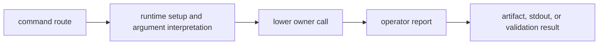

# Common Workflows

Use this page to choose the reader path for common command edits. The command
crate owns how an operator asks for work and how results are presented. It does
not own the lower behavior that produces those results.

## Add Or Change A Command

- Read `crates/bijux-gnss/docs/COMMANDS.md` first.
- Confirm the command solves an operator route, not a lower-owner helper
  problem.
- Update command-facing docs when invocation, flags, defaults, output, or exit
  behavior moves.
- Run the focused command integration test before broad workspace checks.

## Change Workflow Wiring

- Identify which lower owners are being composed.
- Keep command code focused on sequencing, configuration handoff, and report
  presentation.
- Run tests that prove the command calls the intended lower surface and exposes
  the expected result.

## Change Reporting

- Read `crates/bijux-gnss/docs/REPORTING.md`.
- Confirm the change is operator-facing output, not lower-owner policy.
- Preserve owner names and evidence routes in the report.
- Run the narrowest test that exercises the changed report path.

## Change The Facade

- Read `FACADE.md` and `PUBLIC_API.md`.
- Confirm the export is a durable package convenience.
- Avoid adding bespoke helper logic to the command crate.
- Route reusable behavior to the lower owner before exposing it from the top.

## Change Validation

- Read `VALIDATION.md` before editing a validation command.
- Make accepted and rejected cases visible to the operator.
- Name the lower owner when validation fails because a lower contract is wrong.
- Keep command validation separate from runtime, signal, nav, core, or infra
  correctness proof.
