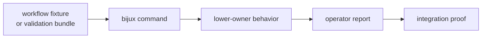

# Fixture and Workflow Care

`bijux-gnss` relies on workflow-facing fixtures and integration expectations
that carry command meaning, not only test convenience.

## Fixture Proof Flow

## Care Rules

| fixture type | proves | care requirement |
| --- | --- | --- |
| command examples | operator-facing command shape remains usable | update docs with command changes |
| validation bundles | CLI routes validation through the right lower owner | keep truth and budget meaning explicit |
| synthetic exports | generated captures and truth artifacts remain coherent | do not hide generator or report drift |
| raw-IQ reporting fixtures | input metadata and front-end summaries render honestly | keep signal and infra ownership clear |
| workflow integration fixtures | command wiring still assembles lower crates correctly | explain whether wiring or expectation changed |

## Change Discipline

- Treat workflow fixtures as public boundary proof.
- Avoid broadening output tolerances only to make a workflow test green.
- Keep lower-owner fixtures lower unless the command boundary is what is being
  proved.
- When a fixture-backed behavior changes, explain whether command wiring,
  lower-owner behavior, or fixture expectation changed.
- Do not use command fixtures to redefine signal, receiver, nav, core, or infra
  contracts.

## First Proof Check

Inspect `crates/bijux-gnss/docs/TESTS.md`,
`crates/bijux-gnss/docs/WORKFLOWS.md`, and the workflow-facing integration
tests under `crates/bijux-gnss/tests/`, especially validation, export, and
raw-IQ reporting families. Those surfaces show whether a fixture change is
preserving public command meaning or merely teaching tests to accept drift.
