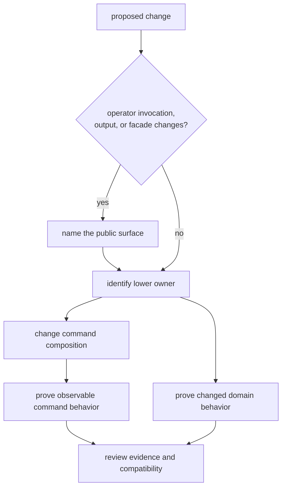
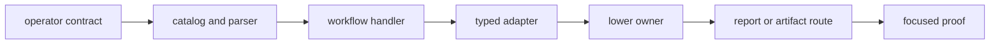

# Command Change Guide

Change `bijux-gnss` from the operator boundary inward. Start with the invocation,
workflow, report, validation result, or facade export that will move; identify
the package that owns the underlying behavior; then prove both the command
handoff and any changed lower contract.

## Route A Change

If no operator job or facade contract changes, the implementation may belong
entirely in a lower package.

## Choose The Workflow

| change | operational route | evidence to preserve |
| --- | --- | --- |
| Command, option, default, or help-visible relationship | [Change sequence](change-sequence.md) | parser behavior, invocation compatibility, and focused command result |
| Multi-stage handoff or lower-package composition | [Common workflows](common-workflows.md) | selected owner, input adaptation, stage order, and resulting artifacts |
| Human or JSON report | [Operator journeys](operator-journeys.md) | status, refusal, stable fields, and route to decisive evidence |
| Validation command or acceptance route | [Fixture and workflow care](fixture-and-workflow-care.md) | accepted, degraded, refused, and malformed cases without regenerated expectations |
| Umbrella facade export | [Review scope](review-scope.md) | feature gate, defining owner, consumer need, and supported import |
| Local build or focused execution | [Local development](local-development.md) and [verification commands](verification-commands.md) | exact command and bounded claim |
| Published command or facade compatibility | [Release and versioning](release-and-versioning.md) | user-visible change, migration, and release evidence |

## Keep One Change Coherent

A coherent command change can cross several files while preserving one durable
intent. Do not combine unrelated command families merely because they share a
runtime helper. Commit when one public route, its documentation, and its
focused evidence agree.

## Preserve Failure Meaning

Command changes must keep operator misconfiguration, unsupported science,
unreadable repository state, degraded runtime outcomes, and internal faults
distinguishable. Rendering may add context; it must not convert a typed refusal
into generic success or hide the lower owner that produced it.

When a command writes evidence, use infrastructure-owned run and artifact
contracts. Do not construct parallel path conventions in handlers or tests.

## Review Before Completion

- The public invocation and defaults still mean what the documentation says.
- The command delegates behavior instead of duplicating it.
- Machine-readable fields remain stable or carry an explicit compatibility
  decision.
- Tests assert observable behavior rather than private helper layout.
- Lower-package tests cover any moved scientific, runtime, or persistence
  meaning.
- Fixtures are independent evidence, not output regenerated by the code under
  test.

The [command test guide](../../../crates/bijux-gnss/docs/TESTS.md),
[execution guide](../../../crates/bijux-gnss/docs/EXECUTION.md), and
[workflow reference](../../../crates/bijux-gnss/docs/WORKFLOWS.md) are the
package-level authorities for these decisions.
